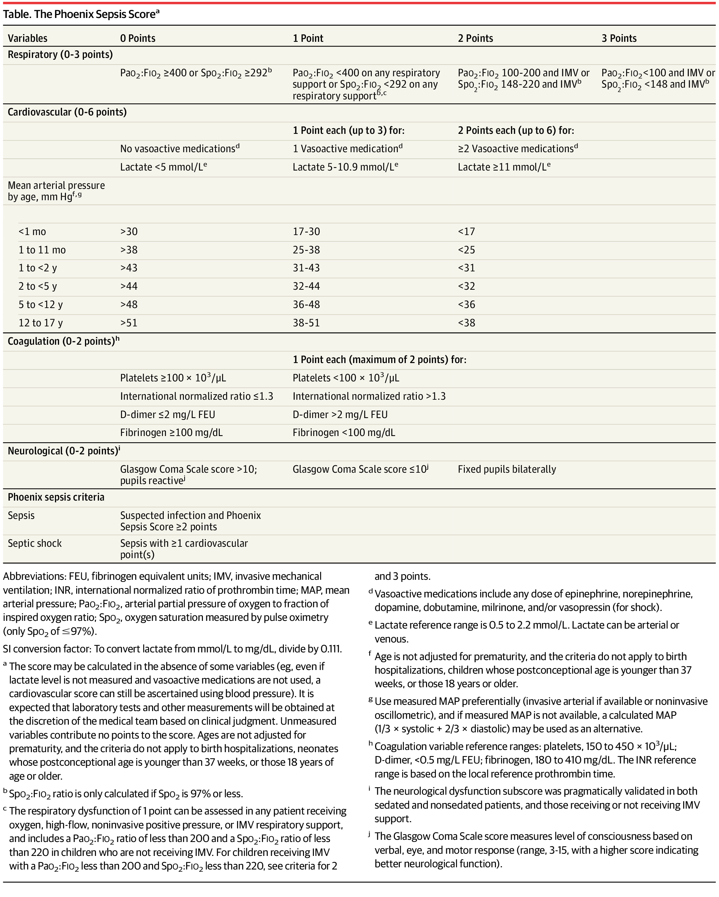

<!DOCTYPE html><html lang="en-US"><head><meta charset="UTF-8"><meta http-equiv="X-UA-Compatible" content="IE=Edge"><link rel="stylesheet" href="/assets/css/just-the-docs-default.css"> <script src="/assets/js/vendor/lunr.min.js"></script> <script src="/assets/js/just-the-docs.js"></script><meta name="viewport" content="width=device-width, initial-scale=1"><link rel="apple-touch-icon" sizes="180x180" href="/apple-touch-icon.png"><link rel="icon" type="image/png" sizes="32x32" href="/favicon-32x32.png"><link rel="icon" type="image/png" sizes="16x16" href="/favicon-16x16.png"><link rel="manifest" href="/site.webmanifest"><link rel="mask-icon" href="/safari-pinned-tab.svg" color="#edbe7a"><link rel="shortcut icon" href="/favicon.ico"><meta name="msapplication-TileColor" content="#da532c"><meta name="msapplication-config" content="/browserconfig.xml"><meta name="theme-color" content="#ffffff"><title>Sepsis score: Sepsis-3 | Dev docs</title><meta name="generator" content="Jekyll v4.4.1" /><meta property="og:title" content="Sepsis score: Sepsis-3" /><meta property="og:locale" content="en_US" /><meta name="description" content="Dev docs made with Jeykll using the Just the Docs theme." /><meta property="og:description" content="Dev docs made with Jeykll using the Just the Docs theme." /><link rel="canonical" href="http://localhost:4000/src/sepsis_score_logic_sepsis3.Rmd" /><meta property="og:url" content="http://localhost:4000/src/sepsis_score_logic_sepsis3.Rmd" /><meta property="og:site_name" content="Dev docs" /><meta property="og:type" content="website" /><meta name="twitter:card" content="summary" /><meta property="twitter:title" content="Sepsis score: Sepsis-3" /> <script type="application/ld+json"> {"@context":"https://schema.org","@type":"WebPage","description":"Dev docs made with Jeykll using the Just the Docs theme.","headline":"Sepsis score: Sepsis-3","url":"http://localhost:4000/src/sepsis_score_logic_sepsis3.Rmd"}</script> <script type="text/javascript" defer src="/assets/js/mathjax-script-type.js"> </script> <script type="text/javascript" id="MathJax-script" defer src="https://cdn.jsdelivr.net/npm/mathjax@3/es5/tex-svg.js"> </script><body> <a class="skip-to-main" href="#main-content">Skip to main content</a> <svg xmlns="http://www.w3.org/2000/svg" class="d-none"> <symbol id="svg-link" viewBox="0 0 24 24"><title>Link</title><svg xmlns="http://www.w3.org/2000/svg" width="24" height="24" viewBox="0 0 24 24" fill="none" stroke="currentColor" stroke-width="2" stroke-linecap="round" stroke-linejoin="round" class="feather feather-link"><path d="M10 13a5 5 0 0 0 7.54.54l3-3a5 5 0 0 0-7.07-7.07l-1.72 1.71"></path><path d="M14 11a5 5 0 0 0-7.54-.54l-3 3a5 5 0 0 0 7.07 7.07l1.71-1.71"></path> </svg> </symbol> <symbol id="svg-menu" viewBox="0 0 24 24"><title>Menu</title><svg xmlns="http://www.w3.org/2000/svg" width="24" height="24" viewBox="0 0 24 24" fill="none" stroke="currentColor" stroke-width="2" stroke-linecap="round" stroke-linejoin="round" class="feather feather-menu"><line x1="3" y1="12" x2="21" y2="12"></line><line x1="3" y1="6" x2="21" y2="6"></line><line x1="3" y1="18" x2="21" y2="18"></line> </svg> </symbol> <symbol id="svg-arrow-right" viewBox="0 0 24 24"><title>Expand</title><svg xmlns="http://www.w3.org/2000/svg" width="24" height="24" viewBox="0 0 24 24" fill="none" stroke="currentColor" stroke-width="2" stroke-linecap="round" stroke-linejoin="round" class="feather feather-chevron-right"><polyline points="9 18 15 12 9 6"></polyline> </svg> </symbol> <symbol id="svg-external-link" width="24" height="24" viewBox="0 0 24 24" fill="none" stroke="currentColor" stroke-width="2" stroke-linecap="round" stroke-linejoin="round" class="feather feather-external-link"><title id="svg-external-link-title">(external link)</title><path d="M18 13v6a2 2 0 0 1-2 2H5a2 2 0 0 1-2-2V8a2 2 0 0 1 2-2h6"></path><polyline points="15 3 21 3 21 9"></polyline><line x1="10" y1="14" x2="21" y2="3"></line> </symbol> <symbol id="svg-doc" viewBox="0 0 24 24"><title>Document</title><svg xmlns="http://www.w3.org/2000/svg" width="24" height="24" viewBox="0 0 24 24" fill="none" stroke="currentColor" stroke-width="2" stroke-linecap="round" stroke-linejoin="round" class="feather feather-file"><path d="M13 2H6a2 2 0 0 0-2 2v16a2 2 0 0 0 2 2h12a2 2 0 0 0 2-2V9z"></path><polyline points="13 2 13 9 20 9"></polyline> </svg> </symbol> <symbol id="svg-search" viewBox="0 0 24 24"><title>Search</title><svg xmlns="http://www.w3.org/2000/svg" width="24" height="24" viewBox="0 0 24 24" fill="none" stroke="currentColor" stroke-width="2" stroke-linecap="round" stroke-linejoin="round" class="feather feather-search"> <circle cx="11" cy="11" r="8"></circle><line x1="21" y1="21" x2="16.65" y2="16.65"></line> </svg> </symbol> <symbol id="svg-copy" viewBox="0 0 16 16"><title>Copy</title><svg xmlns="http://www.w3.org/2000/svg" width="16" height="16" fill="currentColor" class="bi bi-clipboard" viewBox="0 0 16 16"><path d="M4 1.5H3a2 2 0 0 0-2 2V14a2 2 0 0 0 2 2h10a2 2 0 0 0 2-2V3.5a2 2 0 0 0-2-2h-1v1h1a1 1 0 0 1 1 1V14a1 1 0 0 1-1 1H3a1 1 0 0 1-1-1V3.5a1 1 0 0 1 1-1h1v-1z"/><path d="M9.5 1a.5.5 0 0 1 .5.5v1a.5.5 0 0 1-.5.5h-3a.5.5 0 0 1-.5-.5v-1a.5.5 0 0 1 .5-.5h3zm-3-1A1.5 1.5 0 0 0 5 1.5v1A1.5 1.5 0 0 0 6.5 4h3A1.5 1.5 0 0 0 11 2.5v-1A1.5 1.5 0 0 0 9.5 0h-3z"/> </svg> </symbol> <symbol id="svg-copied" viewBox="0 0 16 16"><title>Copied</title><svg xmlns="http://www.w3.org/2000/svg" width="16" height="16" fill="currentColor" class="bi bi-clipboard-check-fill" viewBox="0 0 16 16"><path d="M6.5 0A1.5 1.5 0 0 0 5 1.5v1A1.5 1.5 0 0 0 6.5 4h3A1.5 1.5 0 0 0 11 2.5v-1A1.5 1.5 0 0 0 9.5 0h-3Zm3 1a.5.5 0 0 1 .5.5v1a.5.5 0 0 1-.5.5h-3a.5.5 0 0 1-.5-.5v-1a.5.5 0 0 1 .5-.5h3Z"/><path d="M4 1.5H3a2 2 0 0 0-2 2V14a2 2 0 0 0 2 2h10a2 2 0 0 0 2-2V3.5a2 2 0 0 0-2-2h-1v1A2.5 2.5 0 0 1 9.5 5h-3A2.5 2.5 0 0 1 4 2.5v-1Zm6.854 7.354-3 3a.5.5 0 0 1-.708 0l-1.5-1.5a.5.5 0 0 1 .708-.708L7.5 10.793l2.646-2.647a.5.5 0 0 1 .708.708Z"/> </svg> </symbol> </svg><div class="side-bar"><div class="site-header"> <a href="/" class="site-title lh-tight"> Dev docs </a> <a href="#" id="menu-button" class="site-button"> <svg viewBox="0 0 24 24" class="icon"><use xlink:href="#svg-menu"></use></svg> </a></div><nav aria-label="Main" id="site-nav" class="site-nav"><ul class="nav-list"><li class="nav-list-item"><a href="/" class="nav-list-link">Home</a><li class="nav-list-item"><a href="/pages/bam2fastq.html" class="nav-list-link">BWA</a><li class="nav-list-item"><a href="/pages/bayesian_example1.html" class="nav-list-link">Bayes 1 probability in placenta previa</a><li class="nav-list-item"><a href="/pages/bayesian_example2.html" class="nav-list-link">Bayesian 2 probability in placenta previa</a><li class="nav-list-item"><a href="/pages/bayesian_genetic_carrier.html" class="nav-list-link">Bayesian discrete probability example in genetics</a><li class="nav-list-item"><a href="/pages/bayesian_mcmc_samplers.html" class="nav-list-link">Bayes MCMC samplers</a><li class="nav-list-item"><a href="/pages/bayesian_multiparameter_bioassay.html" class="nav-list-link">Bayes multiparameter bioassay demo</a><li class="nav-list-item"><a href="/pages/bayesian_multiparameter_models.html" class="nav-list-link">Bayes multiparameter models</a><li class="nav-list-item"><a href="/pages/benchmark_pipelines.html" class="nav-list-link">Benchmarking pipeline output</a><li class="nav-list-item"><a href="/pages/bevimed.html" class="nav-list-link">BeviMed</a><li class="nav-list-item"><a href="/pages/biomedit.html" class="nav-list-link">BioMedIT</a><li class="nav-list-item"><a href="/pages/bookmarks.html" class="nav-list-link">Bookmarks</a><li class="nav-list-item"><a href="/pages/bwa.html" class="nav-list-link">BWA</a><li class="nav-list-item"><a href="/pages/causal_inference_stats.html" class="nav-list-link">Causal inference stats</a><li class="nav-list-item"><a href="/pages/causal_inference_whole_game.html" class="nav-list-link">Causal inference mosquito nets</a><li class="nav-list-item"><a href="/pages/data_concepts.html" class="nav-list-link">Data concepts</a><li class="nav-list-item"><a href="/pages/data_stream.html" class="nav-list-link">Data stream</a><li class="nav-list-item"><a href="#" class="nav-list-expander" aria-label="toggle links in Design documents category"> <svg viewBox="0 0 24 24"><use xlink:href="#svg-arrow-right"></use></svg> </a><a href="/pages/design_doc.html" class="nav-list-link">Design documents</a><ul class="nav-list"><li class="nav-list-item "><a href="/pages/design_PCA_SNV_INDEL_V1.html" class="nav-list-link">Design PCA SNV INDEL v1</a><li class="nav-list-item "><a href="/pages/design_dna_snvindel_v1.html" class="nav-list-link">Design DNA SNV INDEL v1</a><li class="nav-list-item "><a href="/pages/design_dna_snvindel_v1_release.html" class="nav-list-link">Design release DNA SNV INDEL v1</a><li class="nav-list-item "><a href="/pages/design_dna_snvindel_v2_release.html" class="nav-list-link">Design release DNA SNV INDEL v2</a><li class="nav-list-item "><a href="/pages/design_qv_snvindel_v1.html" class="nav-list-link">Design QV SNV INDEL v1</a><li class="nav-list-item "><a href="/pages/design_statistical_genomics_v1.html" class="nav-list-link">Design statistical genomics v1</a></ul><li class="nav-list-item"><a href="/pages/dna_annotation.html" class="nav-list-link">DNA annotation</a><li class="nav-list-item"><a href="/pages/dna_interpretation.html" class="nav-list-link">DNA interpretation</a><li class="nav-list-item"><a href="/pages/dna_qc.html" class="nav-list-link">DNA QC</a><li class="nav-list-item"><a href="/pages/docker_singularity.html" class="nav-list-link">Docker with singularity</a><li class="nav-list-item"><a href="/pages/exomiser.html" class="nav-list-link">Exomiser</a><li class="nav-list-item"><a href="/pages/exomiser_phenodigm.html" class="nav-list-link">Exomiser phenodigm</a><li class="nav-list-item"><a href="/pages/fastp.html" class="nav-list-link">FASTP</a><li class="nav-list-item"><a href="/pages/fastq.html" class="nav-list-link">FASTQ format data</a><li class="nav-list-item"><a href="/pages/filter_vcf_bcftools.html" class="nav-list-link">Filter VCF with bcftools</a><li class="nav-list-item"><a href="/pages/financial_management.html" class="nav-list-link">Financial management</a><li class="nav-list-item"><a href="/pages/guru.html" class="nav-list-link">Guru variant interpretation</a><li class="nav-list-item"><a href="/pages/gwas.html" class="nav-list-link">GWAS analysis</a><li class="nav-list-item"><a href="/pages/hpc.html" class="nav-list-link">HPC infrastructure</a><li class="nav-list-item"><a href="/pages/inf_causal_metab_sem.html" class="nav-list-link">Inference of causal metabolite networks</a><li class="nav-list-item"><a href="/pages/layout.html" class="nav-list-link">Layout</a><li class="nav-list-item"><a href="/pages/mathjax.html" class="nav-list-link">MathJax config</a><li class="nav-list-item"><a href="/pages/mbdf_models.html" class="nav-list-link">MBDF models</a><li class="nav-list-item"><a href="/pages/mbdf_supervised.html" class="nav-list-link">MBDF supervised</a><li class="nav-list-item"><a href="/pages/mbdf_unsupervised.html" class="nav-list-link">MBDF unsupervised</a><li class="nav-list-item"><a href="/pages/metadata.html" class="nav-list-link">WGS metadata</a><li class="nav-list-item"><a href="/pages/metadata_users.html" class="nav-list-link">WGS metadata users</a><li class="nav-list-item"><a href="/pages/metrics_bcftoolscounts.html" class="nav-list-link">Metrics Bcftools counts</a><li class="nav-list-item"><a href="/pages/metrics_bcftoolsstats.html" class="nav-list-link">Metrics Bcftools stats</a><li class="nav-list-item"><a href="/pages/metrics_collectwgsmetrics.html" class="nav-list-link">Metrics CollectWgsMetrics</a><li class="nav-list-item"><a href="/pages/multiblock_data_fusion.html" class="nav-list-link">Multiblock data fusion</a><li class="nav-list-item"><a href="/pages/my_voice.html" class="nav-list-link">QV - My voice</a><li class="nav-list-item"><a href="/pages/panels_disease.html" class="nav-list-link">Panels disease gene</a><li class="nav-list-item"><a href="/pages/pca_biplot_1kg.html" class="nav-list-link">PCA biplot 1000genomes</a><li class="nav-list-item"><a href="/pages/pca_features.html" class="nav-list-link">PCA features</a><li class="nav-list-item"><a href="/pages/platform_updates.html" class="nav-list-link">Platform updates</a><li class="nav-list-item"><a href="/pages/precision_med.html" class="nav-list-link">Precision Medicine Unit (PMU)</a><li class="nav-list-item"><a href="/pages/present/presentations.html" class="nav-list-link">Presentations</a><li class="nav-list-item"><a href="/pages/read_group.html" class="nav-list-link">Read group</a><li class="nav-list-item"><a href="/pages/ref.html" class="nav-list-link">Reference genome</a><li class="nav-list-item"><a href="/pages/rl_finte_mdp.html" class="nav-list-link">RL finite MDP</a><li class="nav-list-item"><a href="/pages/slurm_manager.html" class="nav-list-link">SLURM monitoring</a><li class="nav-list-item"><a href="/pages/slurm_sbatch.html" class="nav-list-link">SLURM sbatch headers</a><li class="nav-list-item"><a href="/pages/stats_altman_bland_analysis_of_methods.html" class="nav-list-link">Stats Analysis of methods</a><li class="nav-list-item"><a href="/pages/stats_altman_bland_ci_from_p.html" class="nav-list-link">Stats CI from P</a><li class="nav-list-item"><a href="/pages/stats_altman_bland_correlation.html" class="nav-list-link">Stats Correlation, regression and repeated data</a><li class="nav-list-item"><a href="/pages/stats_altman_bland_odds_ratios.html" class="nav-list-link">Stats Odds ratios, SE & CI</a><li class="nav-list-item"><a href="/pages/stats_altman_bland_roc_curve.html" class="nav-list-link">Stats Receiver operating characteristic plots</a><li class="nav-list-item"><a href="/pages/stats_altman_bland_sensitivity_specificity.html" class="nav-list-link">Stats Sensitivity and specificity</a><li class="nav-list-item"><a href="/pages/storage_architecture_plan.html" class="nav-list-link">Storage architecture plan</a><li class="nav-list-item"><a href="/pages/storage_estimates.html" class="nav-list-link">Storage estimates</a><li class="nav-list-item"><a href="/pages/storage_use_sync_and_versioning.html" class="nav-list-link">Storage, usage, and Git practices</a><li class="nav-list-item"><a href="/pages/style.html" class="nav-list-link">Style page guide</a><li class="nav-list-item"><a href="/pages/style_writing.html" class="nav-list-link">Style writing guide</a><li class="nav-list-item"><a href="/pages/sv.html" class="nav-list-link">Structural variation detection</a><li class="nav-list-item"><a href="/pages/synth_data.html" class="nav-list-link">Synthetic data</a><li class="nav-list-item"><a href="/pages/Phoenix_Sepsis_Score_logic.html" class="nav-list-link">Sepsis score: Phoenix</a><li class="nav-list-item"><a href="/pages/variant_concept.html" class="nav-list-link">Variant to RDF concept</a><li class="nav-list-item"><a href="/pages/vcf.html" class="nav-list-link">VCF - Variant Call Format</a><li class="nav-list-item"><a href="/pages/vcf_gvcf.html" class="nav-list-link">VCF and gVCF</a><li class="nav-list-item"><a href="/pages/virtual_panels.html" class="nav-list-link">Virtual gene panels</a><li class="nav-list-item"><a href="/pages/vsat.html" class="nav-list-link">VSAT with SKAT</a><li class="nav-list-item"><a href="/pages/vsat_setID.html" class="nav-list-link">SetID for VSAT</a><li class="nav-list-item"><a href="/pages/variables.html" class="nav-list-link">Variables</a><li class="nav-list-item"><a href="/pages/acat.html" class="nav-list-link">ACAT</a><li class="nav-list-item"><a href="/pages/acmg_criteria_table_main.html" class="nav-list-link">ACMG criteria</a><li class="nav-list-item"><a href="/pages/aggregate_multiplex.html" class="nav-list-link">Aggregate multiplexed data</a><li class="nav-list-item"><a href="/pages/annotation_table.html" class="nav-list-link">Annotation table</a><li class="nav-list-item"><a href="/pages/documentation_log.html" class="nav-list-link">Documentation log</a></ul></nav><footer class="site-footer"> Maintained by <a href="https://github.com/DylanLawless">Dylan Lawless</a> for <a href="https://switzerlandomics.ch">SwitzerlandOmics.ch</a>.</footer></div><div class="main" id="top"><div id="main-header" class="main-header"><div class="search"><div class="search-input-wrap"> <input type="text" id="search-input" class="search-input" tabindex="0" placeholder="Search Dev docs" aria-label="Search Dev docs" autocomplete="off"> <label for="search-input" class="search-label"><svg viewBox="0 0 24 24" class="search-icon"><use xlink:href="#svg-search"></use></svg></label></div><div id="search-results" class="search-results"></div></div><nav aria-label="Auxiliary" class="aux-nav"><ul class="aux-nav-list"><li class="aux-nav-list-item"> <a href="https://github.com/docs-switzerlandomics.github.io" class="site-button" > Github </a><li class="aux-nav-list-item"> <a href="https://switzerlandomics.ch" class="site-button" > SwitzerlandOmics.ch </a></ul></nav></div><div id="main-content-wrap" class="main-content-wrap"><div id="main-content" class="main-content" role="main"> This doc was built with: `rmarkdown::render("sepsis_score_logic.Rmd", output_file = "../pages/sepsis_score_logic.md")` # Implementing the Phoenix sepsis score ```{r setup, include=FALSE, echo=FALSE, warning=FALSE, message=FALSE, results='asis'} set.seed(123) # Set seed for reproducibility knitr::opts_chunk$set(echo = TRUE, fig.path='../assets/images/') library(ggplot2); theme_set(theme_bw()) library(dplyr) library(stringr) library(patchwork) library(tidyr) ``` ```{r} # install.packages("phoenix", repos = "https://cran.rstudio.com") library(phoenix) data <- sepsis ``` ```{r data, echo = TRUE, message=FALSE, warning=FALSE} # Subject cohort ---- # sample_count <- x # # # Define min-max ranges for each variable # PaO2_FiO2_range <- c(x, x) # # # Generate random data for a given number of subjects # data <- data.frame( # subject_id = 1:sample_count, # PaO2_FiO2 = round(runif(sample_count, PaO2_FiO2_range[1], PaO2_FiO2_range[2]), 2), # ) ``` ```{r data-head, echo = TRUE, message=FALSE, warning=FALSE} print(head(data)) ``` ```{r classes, echo = FALSE, message=FALSE, warning=FALSE} # Function to get column classes for each dataset get_column_classes <- function(df) { sapply(df, class) # Returns the class of each column in the dataframe } # Apply this function to each dataframe and store the results column_classes <- lapply(data, get_column_classes) # Combine the results into a single data frame for easier analysis column_classes_df <- bind_rows(column_classes, .id = "DataFrame") head(column_classes_df) ``` ## Data distribution plots Visual representations of the dataset are generated to illustrate the distribution of each clinical measurement. These plots are instrumental in identifying trends, outliers, and the overall distribution of data points within the synthetic cohort: - Histograms and bar plots provide insights into the frequency and categorisation of data points, facilitating preliminary assessments of data quality and distribution integrity. ```{r plot, echo = FALSE, message=FALSE, warning=FALSE} # # Plot ---- # # Function to create a histogram or bar plot depending on the data type # create_histogram <- function(data, column_name) { # # Skip if not numeric or logical # if (!is.numeric(data[[column_name]]) && !is.logical(data[[column_name]])) { # return(NULL) # } # # # Decide the plot type based on column data type # if (is.logical(data[[column_name]])) { # # Use geom_bar for logical data to represent TRUE and FALSE separately # p <- ggplot(data, aes_string(x = column_name, fill = column_name)) + # geom_bar() + # scale_fill_manual(values = c("TRUE" = "#0e3b5c", "FALSE" = "#b3cde3")) + # labs(x = column_name, y = "Count") + # guides(fill = FALSE) # # ggtitle(paste("Bar Plot of", column_name)) # } else { # # Use geom_histogram for numeric data # p <- ggplot(data, aes_string(x = column_name)) + # geom_histogram(bins = 10, fill = "#0e3b5c", color = "black") + # labs(x = column_name, y = "Frequency") # # ggtitle(paste("Histogram of", column_name)) # } # # return(p) # } # # # Generate and print histograms for each column except 'subject_id' # column_names <- setdiff(names(data), "subject_id") # # # Split column names into batches # column_chunks <- split(column_names, ceiling(seq_along(column_names) / 6)) # Number of plots per chunk # # # Generate and combine plots by batches # plot_batches <- lapply(column_chunks, function(chunk) { # plots <- lapply(chunk, create_histogram, data = data) # combined_plot <- patchwork::wrap_plots(plots, ncol = 3) # Number of columns per row # return(combined_plot) # }) # # # Print each batch of plots # for (plot in plot_batches) { # print(plot) # } library(ggplot2) library(patchwork) # Function to create a histogram or bar plot depending on the data type create_histogram <- function(data, column_name) { # Skip if not numeric or logical if (!is.numeric(data[[column_name]]) && !is.logical(data[[column_name]])) { return(NULL) } # Decide the plot type based on column data type if (is.logical(data[[column_name]])) { # Use geom_bar for logical data to represent TRUE and FALSE separately p <- ggplot(data, aes_string(x = column_name, fill = column_name)) + geom_bar() + scale_fill_manual(values = c("TRUE" = "#0e3b5c", "FALSE" = "#b3cde3")) + labs(x = column_name, y = "Count") + guides(fill = FALSE) } else { # Use geom_histogram for numeric data p <- ggplot(data, aes_string(x = column_name)) + geom_histogram(bins = 10, fill = "#0e3b5c", color = "black") + labs(x = column_name, y = "Frequency") } return(p) } # Generate and print histograms for each column except 'subject_id' column_names <- setdiff(names(data), "subject_id") # Split column names into batches column_chunks <- split(column_names, ceiling(seq_along(column_names) / 6)) # Number of plots per chunk # Generate and combine plots by batches plot_batches <- lapply(column_chunks, function(chunk) { plots <- lapply(chunk, create_histogram, data = data) # Remove NULL entries before attempting to combine plots valid_plots <- Filter(function(x) !is.null(x), plots) if (length(valid_plots) > 0) { combined_plot <- patchwork::wrap_plots(valid_plots, ncol = 3) # Number of columns per row return(combined_plot) } return(NULL) }) # Print each batch of plots for (plot in plot_batches) { if (!is.null(plot)) { print(plot) } } ``` ## Logic functions for scoring Defines the functional logic for calculating scores based on the clinical criteria outlined. Each function is tailored to process specific aspects of patient data, converting raw measurements into actionable clinical scores: - These functions are the computational backbone of the scoring system, translating clinical data into standardized scores that reflect patient health status. **Respiratory score calculation:** ```{r logic1, echo = TRUE, message=FALSE, warning=FALSE} # Respiratory score calculation respiratory_score <- function(PaO2_FiO2, SpO2_FiO2, is_on_IMV) { if (PaO2_FiO2 >= 400 || SpO2_FiO2 >= 292) { return(0) } else if ((PaO2_FiO2 < 400 && SpO2_FiO2 < 292) || !is_on_IMV) { return(1) } else if ((PaO2_FiO2 >= 100 && PaO2_FiO2 < 200 && is_on_IMV) || (SpO2_FiO2 >= 148 && SpO2_FiO2 < 220 && is_on_IMV)) { return(2) } else { return(3) } } ``` **Cardiovascular score calculation:** ```{r logic2, echo = TRUE, message=FALSE, warning=FALSE} # Cardiovascular score calculation cardiovascular_score <- function(lactate, vasoactive_medications) { score <- 0 # Check for 0 points condition explicitly if (vasoactive_medications == 0 && lactate <= 5) { return(score) # Return 0 if no medications and low lactate } # Points for vasoactive medications if (vasoactive_medications >= 2) { score <- score + 6 # Max 6 points for 2 or more medications } else if (vasoactive_medications == 1) { score <- score + 2 # 2 points for 1 medication } # Points for lactate levels if (lactate > 11) { score <- score + 2 } else if (lactate >= 5.1 && lactate <= 10.9) { score <- score + 1 } return(score) } ``` **Coagulation score calculation:** ```{r logic3, echo = TRUE, message=FALSE, warning=FALSE} # Coagulation score calculation coagulation_score <- function(platelets, INR, d_dimer, fibrinogen) { score <- 0 if (platelets < 100 || INR > 1.3 || d_dimer > 2 || fibrinogen < 100) { score <- score + 1 } return(min(score, 2)) # Max of 2 points } ``` **Neurological score calculation:** ```{r logic4, echo = TRUE, message=FALSE, warning=FALSE} # Neurological score calculation neurological_score <- function(GCS, pupils_reactive) { if (!pupils_reactive) { return(2) } else if (GCS <= 10) { return(1) } else { return(0) } } ``` ## Decision algorithm for scoring Integrates individual scores to derive a comprehensive sepsis risk assessment. The algorithm considers the cumulative impact of respiratory, cardiovascular, coagulation, and neurological scores to determine the overall risk of sepsis and septic shock: - This decision-making algorithm is pivotal for applying the scoring system in a clinical context, providing a final determination that supports clinical decision-making. ```{r Decision, echo = TRUE, message=FALSE, warning=FALSE} # Modified evaluate_sepsis to handle a vector from apply evaluate_sepsis <- function(subject) { # Calculate scores res_score <- respiratory_score(subject["PaO2_FiO2"], subject["SpO2_FiO2"], subject["is_on_IMV"]) cardio_score <- cardiovascular_score(subject["lactate"], subject["vasoactive_medications"]) coag_score <- coagulation_score(subject["platelets"], subject["INR"], subject["d_dimer"], subject["fibrinogen"]) neuro_score <- neurological_score(subject["GCS"], subject["pupils_reactive"]) # Total Phoenix Sepsis Score total_score <- res_score + cardio_score + coag_score + neuro_score # Assess criteria result <- if (total_score >= 2) { if (cardio_score >= 1) { "Septic shock" } else { "Sepsis" } } else { "Monitor and reassess" } # Ensure output is always a data frame return(data.frame(result = result, total_score = total_score)) } ``` ## Run evaluation and return result Applies the decision algorithm across the patient dataset, appending the results to the original data frame. This process culminates in the generation of a final dataset that includes both the raw clinical measurements and the derived sepsis scores, ready for further analysis or review: - The output enriches the dataset with valuable insights into patient health, enabling clinicians and researchers to conduct detailed analyses or refine the scoring criteria based on empirical evidence. ```{r eval} # Running the assessment for each subject # Check if the 'data' DataFrame exists and is correct if ("data" %in% ls() && is.data.frame(data)) { # Running the assessment for each subject and storing results evaluation_results <- do.call(rbind, apply(data, 1, evaluate_sepsis)) # Apply function row-wise # Append results to the original data frame data$result <- evaluation_results$result data$total_score <- evaluation_results$total_score data <- data %>% dplyr::select(subject_id, result, total_score, everything()) } else { print("Data object not found or is not a data frame.") } ``` ```{r data-head2, echo = TRUE, message=FALSE, warning=FALSE} print(head(data)) ``` ## Conclustion For every patient (subject) the newly calculatied result columns provide the Phoenix score conclusions: `result` of **sepsis**, **septic shock**, or **monitor and reassess** and `total_score` of the value **0..n**. Audomated classificaion algorithms may be used to provide a precision medicine approach to monitoring and treatment, either locally or as part of national registries. ## Abbreviations and definitions - **FEU**: Fibrinogen Equivalent Units - **GCS**: Glasgow Coma Scale - **IMV**: Invasive Mechanical Ventilation - **INR**: International Normalized Ratio of Prothrombin Time - **MAP**: Mean Arterial Pressure - **PaO2:FIO2**: Arterial Partial Pressure of Oxygen to Fraction of Inspired Oxygen Ratio - used to determine the degree of hypoxemia and acute respiratory distress syndrome (ARDS). - **Phoenix Sepsis Criteria**: A modern set of guidelines designed to assess sepsis with a focus on paediatric patients, emphasizing organ dysfunction. - **Sepsis-1, Sepsis-2, Sepsis-3**: These refer to the evolving definitions of sepsis over time, each marking a significant update in how sepsis is clinically identified and diagnosed based on symptoms and physiological responses. - **SIRS**: Systemic inflammatory response syndrome - **SOFA**: Sequential Organ Failure Assessment - **SpO2**: Oxygen Saturation Measured by Pulse Oximetry (only SpO2 of ≤97%)  Criteria table from [@schlapbach2024international]. ## References<hr><footer><div class="d-flex mt-2"></div></footer></div></div><div class="search-overlay"></div></div>
