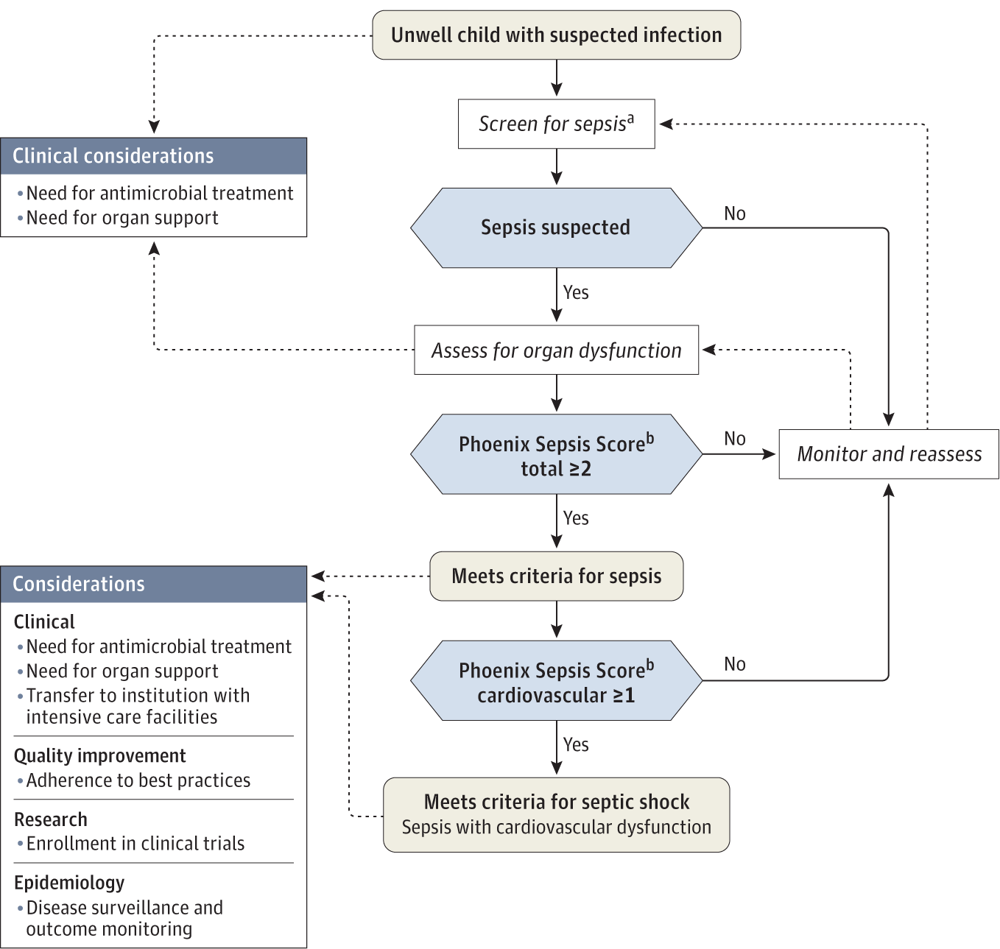
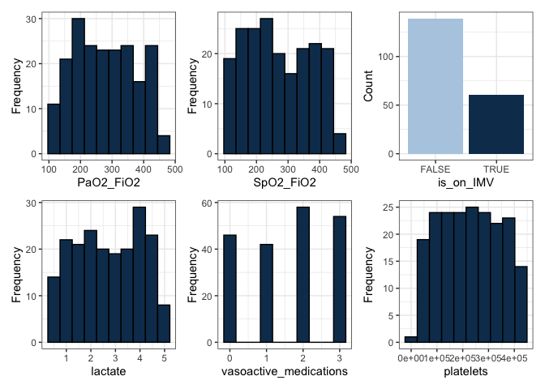
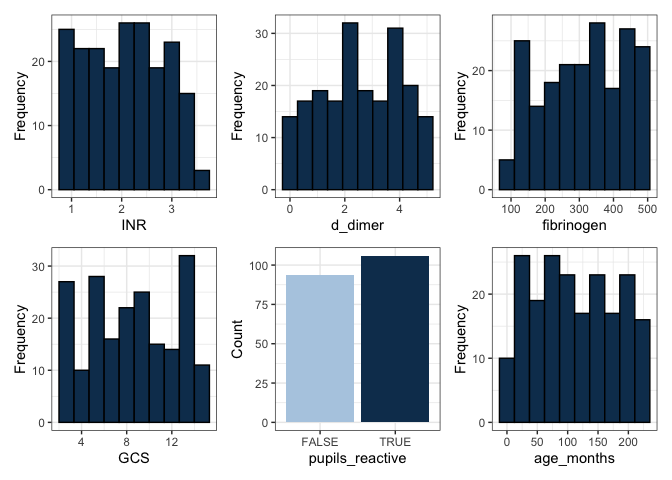
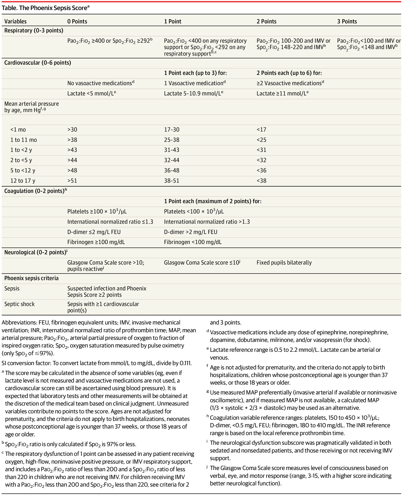

This doc was built with:
`rmarkdown::render("sepsis_score_logic_phoenix.Rmd", output_file = "../pages/phoenix_sepsis_score_logic.md")`

# Implementing the Phoenix sepsis score

## Abstract

This work deomostrates how to implement the Phoenix Sepsis Score
criteria for sepsis and septic shock in children. Pediatric sepsis in
children (\<18 years) with suspected infection can be identified by at
least 2 points in the novel Phoenix Sepsis Score, including dysfunction
of the respiratory, cardiovascular, coagulation, and/or neurological
systems; and septic shock as sepsis with at least 1 cardiovascular point
in the Phoenix Sepsis Score. These criteria for pediatric sepsis and
septic shock are globally applicable. The original investigation can be
read at: International consensus criteria for pediatric sepsis and
septic shock (Schlapbach et al. 2024). The phoenix R package and Python
model are available from (DeWitt et al. 2024). The original
investigation can be read at: International consensus criteria for
pediatric sepsis and septic shock (Schlapbach et al. 2024). The phoenix
R package and Python model are available from (DeWitt et al. 2024). The
implementations of the Phoenix Sepsis Criteria in R, Python, and SQL are
found here <https://github.com/cu-dbmi-peds/phoenix/> and here
<https://pypi.org/project/phoenix-sepsis/>, by the original authors
(DeWitt et al. 2024). An example implementation of the sofa score (a
different score for adult sepsis) is shown in (Bennett, Plecko, and Ukor
2023) Intensive Care Unit Data with R <https://github.com/eth-mds/ricu>.



Decision tree from (Schlapbach et al. 2024).

## History

Sepsis definitions have evolved incrementally. We first breifly
summarise these stages before getting to the Phoenix sepsis score
definitions.

**First Formal Definition (1992) - Sepsis-1 (Carlton et al. 2019)**

- Introduced at the American College of Chest Physicians and Society of
  Critical Care Medicine Consensus Conference. Defined as an excessive
  inflammatory response to infection, requiring at least two
  abnormalities (temperature, heart rate, respiratory rate, or white
  blood cell count).

**Second Definition Update (Early 2000s) - Sepsis-2 (Souza et al.
2022)**

- This update expanded the signs of an inflammatory response but
  remained similar to Sepsis-1.

**Pediatric-Specific Sepsis Criteria (2005) (Goldstein, Giroir, and
Randolph 2005; Souza et al. 2022; Reinhart et al. 2017)**

- Developed during the International Pediatric Sepsis Consensus
  Conference, defining pediatric sepsis as two or more SIRS criteria in
  the context of infection, adjusting for pediatric physiology.

**Third Definition Update (2016) - Sepsis-3 (Levy et al. 2003; Seymour
et al. 2016)**

- Sepsis redefined as life-threatening acute organ dysfunction due to a
  dysregulated host response to infection, with SIRS criteria removed.
  SOFA score of at least 2 points adopted for defining acute organ
  dysfunction.

**Phoenix Sepsis Criteria (2019) (Gebara 2005; Levy et al. 2003; Seymour
et al. 2016; Singer et al. 2016)**

- Following a data-driven review, pediatric sepsis is redefined as
  life-threatening organ dysfunction of the respiratory, cardiovascular,
  coagulation, and neurological systems, as demonstrated by a Phoenix
  Sepsis Score of at least 2 in the setting of confirmed or suspected
  infection.

## Phoenix sepsis score criteria

This section delineates the scoring system used to evaluate respiratory
and cardiovascular functions, mean arterial pressure by age,
coagulation, and neurological status in a clinical setting. The scoring
criteria are stratified to reflect varying degrees of severity in
patient conditions, providing a structured framework for assessing the
risk of sepsis:

### Definitions

- **Respiratory Score**: Assesses pulmonary efficiency based on the
  ratio of arterial oxygen partial pressure (PaO2) to fractional
  inspired oxygen (FiO2), with adjustments for respiratory support and
  invasive mechanical ventilation (IMV).
- **Cardiovascular Score**: Evaluates circulatory system stability by
  accounting for lactate levels and the usage of vasoactive medications,
  which are indicative of cardiovascular strain and potential shock.
- **Mean Arterial Pressure**: Provides age-specific benchmarks for
  arterial pressure, serving as critical indicators of circulatory
  health in paediatric to adolescent patients.
- **Coagulation Score**: Reviews the blood’s ability to clot
  appropriately, utilising platelet count, International Normalized
  Ratio (INR), D-dimer levels, and fibrinogen as markers of potential
  disseminated intravascular coagulation or other coagulopathies.
- **Neurological Score**: Uses the Glasgow Coma Scale to assess
  neurological function, crucial for determining the impact of sepsis on
  the central nervous system.

### Scoring logic

**Respiratory Score (0-3 points):**

- 0 Points: PaO2:FiO2 ≥ 400 or SpO2:FiO2 ≥ 292 (only if SpO2 is 97% or
  less) \[b\]
- 1 Point: PaO2:FiO2 \< 400 on any respiratory support or SpO2:FiO2 \<
  292 on any respiratory support \[b,c\]
- 2 Points: PaO2:FiO2 between 100-200 and IMV or SpO2:FiO2 between
  148-220 and IMV \[b\]
- 3 Points: PaO2:FiO2 \< 100 and IMV or SpO2:FiO2 \< 148 and IMV \[b\]

**Cardiovascular Score (0-6 points):**

- 0 Points: No vasoactive medications and Lactate \<= 5 mmol/L \[d\]
- 1 Point: Each up to 3 points for:
  - 1 Vasoactive medication \[d\]
  - Lactate between 5.1-10.9 mmol/L \[e\]
- 2 Points: Each up to 6 points for:
  - ≥2 Vasoactive medications \[d\]
  - Lactate ≥11 mmol/L \[e\]

**Mean Arterial Pressure by age, mm Hg: \[f,g\]**

- \< 1 month: \>30 (0 points), 17-30 (1 point), \<17 (2 points)
- 1 to 11 months: \>38 (0 points), 25-38 (1 point), \<25 (2 points)
- 1 to \<2 years: \>43 (0 points), 31-43 (1 point), \<31 (2 points)
- 2 to \<5 years: \>44 (0 points), 32-44 (1 point), \<32 (2 points)
- 5 to \<12 years: \>48 (0 points), 36-48 (1 point), \<36 (2 points)
- 12 to 17 years: \>51 (0 points), 38-51 (1 point), \<38 (2 points)

**Coagulation Score (0-2 points): \[h\]**

- 0 Points: Platelets ≥100 x 10^3/μL, INR \<=1.3, D-dimer \<=2 mg/L FEU,
  Fibrinogen ≥100 mg/dL
- 1 Point each (maximum 2 points): Platelets \<100 x 10^3/μL, INR \>1.3,
  D-dimer \>2 mg/L FEU, Fibrinogen \<100 mg/dL

**Neurological Score (0-2 points):**

- 0 Points: Glasgow Coma Scale score \>10; pupils reactive
- 1 Point: Glasgow Coma Scale score ≤10 \[j\]
- 2 Points: Fixed pupils bilaterally

**Phoenix Sepsis Criteria:**

- Sepsis: Suspected infection and Phoenix Sepsis Score ≥2 points
- Septic Shock: Sepsis with ≥1 cardiovascular points

**SI Conversion Factor**:  
- To convert lactate from mmol/L to mg/dL, divide by 0.111.

**Additional Notes**:

- \[a\] The score may be calculated even if some variables are absent
  (e.g., even if lactate level is not measured and vasoactive
  medications are not used, a cardiovascular score can still be
  ascertained using blood pressure). Laboratory tests and other
  measurements should be obtained at the discretion of the medical team
  based on clinical judgment. Unmeasured variables contribute no points
  to the score. Ages are not adjusted for prematurity, and the criteria
  do not apply to birth hospitalizations, neonates whose
  postconceptional age is younger than 37 weeks, or those 18 years of
  age or older.
- \[b\] SpO2:FIO2 ratio is only calculated if SpO2 is 97% or less.
- \[c\] Respiratory dysfunction scoring varies based on the type of
  respiratory support provided and includes specific criteria for
  PaO2:FIO2 and SpO2:FIO2 ratios.
- \[d\] Vasoactive medications include any dose of epinephrine,
  norepinephrine, dopamine, dobutamine, milrinone, and/or vasopressin
  (for shock).
- \[e\] Lactate reference range is 0.5 to 2.2 mmol/L. Lactate can be
  arterial or venous.
- \[f\] Ages are not adjusted for prematurity, and the criteria do not
  apply to birth hospitalizations, neonates whose postconceptional age
  is younger than 37 weeks, or those 18 years of age or older.
- \[g\] Use measured MAP preferentially (invasive arterial if available
  or noninvasive oscillometric), and if measured MAP is not available, a
  calculated MAP (1/3 × systolic + 2/3 × diastolic) may be used as an
  alternative.
- \[h\] Coagulation variable reference ranges: platelets, 150 to 450 ×
  10^3/μL; D-dimer, \<0.5 mg/L FEU; fibrinogen, 180 to 410 mg/dL. The
  INR reference range is based on the local reference prothrombin time.
- \[i\] The neurological dysfunction subscore was validated in both
  sedated and nonsedated patients, and those receiving or not receiving
  IMV support.
- \[j\] The Glasgow Coma Scale score measures the level of consciousness
  based on verbal, eye, and motor response (range, 3-15, with a higher
  score indicating better neurological function).

## Define a dataset

This section details the synthetic generation of patient data,
simulating a variety of clinical scenarios to test the scoring system.
Data points including respiratory and cardiovascular function,
coagulation factors, and neurological status are randomly generated
within defined clinical ranges, creating a robust dataset for
analysis: - The synthetic dataset is crucial for validating the scoring
algorithms under controlled conditions, ensuring they are robust across
typical clinical variations.

``` r
# Subject cohort ----
sample_count <- 200

# Define min-max ranges for each variable
PaO2_FiO2_range <- c(100, 450)
SpO2_FiO2_range <- c(100, 450)
lactate_range <- c(0.5, 5)
platelets_range <- c(20000, 450000)
INR_range <- c(0.8, 3.5)
d_dimer_range <- c(0, 5)
fibrinogen_range <- c(100, 500)
GCS_range <- c(3, 15)
age_months_range <- c(1, 228)

# Generate random data for a given number of subjects
data <- data.frame(
  subject_id = 1:sample_count,
  PaO2_FiO2 = round(runif(sample_count, PaO2_FiO2_range[1], PaO2_FiO2_range[2]), 2),
  SpO2_FiO2 = round(runif(sample_count, SpO2_FiO2_range[1], SpO2_FiO2_range[2]), 2),
  is_on_IMV = sample(c(TRUE, FALSE), sample_count, replace = TRUE, prob = c(0.3, 0.7)),
  lactate = round(runif(sample_count, lactate_range[1], lactate_range[2]), 2),
  vasoactive_medications = sample(0:3, sample_count, replace = TRUE),
  platelets = round(runif(sample_count, platelets_range[1], platelets_range[2]), 0),
  INR = round(runif(sample_count, INR_range[1], INR_range[2]), 2),
  d_dimer = round(runif(sample_count, d_dimer_range[1], d_dimer_range[2]), 2),
  fibrinogen = round(runif(sample_count, fibrinogen_range[1], fibrinogen_range[2]), 2),
  GCS = sample(GCS_range[1]:GCS_range[2], sample_count, replace = TRUE),
  pupils_reactive = sample(c(TRUE, FALSE), sample_count, replace = TRUE),
  age_months = sample(age_months_range[1]:age_months_range[2], sample_count, replace = TRUE)
)
```

``` r
print(head(data))
```

    ##   subject_id PaO2_FiO2 SpO2_FiO2 is_on_IMV lactate
    ## 1          1    200.65    183.55      TRUE    1.57
    ## 2          2    375.91    436.83     FALSE    3.59
    ## 3          3    243.14    310.48      TRUE    1.52
    ## 4          4    409.06    280.26     FALSE    1.93
    ## 5          5    429.16    240.90     FALSE    1.28
    ## 6          6    115.94    408.09     FALSE    4.11
    ##   vasoactive_medications platelets  INR d_dimer fibrinogen
    ## 1                      2    137658 3.12    1.17     355.67
    ## 2                      0    275363 3.20    1.15     149.93
    ## 3                      3     88879 2.12    0.31     202.11
    ## 4                      3    386975 2.74    2.49     428.23
    ## 5                      2    384528 2.11    1.22     421.51
    ## 6                      0    225491 3.47    3.79     118.33
    ##   GCS pupils_reactive age_months
    ## 1  12           FALSE        199
    ## 2   4            TRUE         26
    ## 3  15            TRUE        209
    ## 4   8            TRUE        175
    ## 5  15            TRUE         37
    ## 6  14           FALSE         32

## Data distribution plots

Visual representations of the dataset are generated to illustrate the
distribution of each clinical measurement. These plots are instrumental
in identifying trends, outliers, and the overall distribution of data
points within the synthetic cohort: - Histograms and bar plots provide
insights into the frequency and categorisation of data points,
facilitating preliminary assessments of data quality and distribution
integrity.

<!-- --><!-- -->

## Logic functions for scoring

Defines the functional logic for calculating scores based on the
clinical criteria outlined. Each function is tailored to process
specific aspects of patient data, converting raw measurements into
actionable clinical scores: - These functions are the computational
backbone of the scoring system, translating clinical data into
standardized scores that reflect patient health status.

**Respiratory score calculation:**

``` r
# Respiratory score calculation
respiratory_score <- function(PaO2_FiO2, SpO2_FiO2, is_on_IMV) {
  if (PaO2_FiO2 >= 400 || SpO2_FiO2 >= 292) {
    return(0)
  } else if ((PaO2_FiO2 < 400 && SpO2_FiO2 < 292) || !is_on_IMV) {
    return(1)
  } else if ((PaO2_FiO2 >= 100 && PaO2_FiO2 < 200 && is_on_IMV) || 
             (SpO2_FiO2 >= 148 && SpO2_FiO2 < 220 && is_on_IMV)) {
    return(2)
  } else {
    return(3)
  }
}
```

**Cardiovascular score calculation:**

``` r
# Cardiovascular score calculation
cardiovascular_score <- function(lactate, vasoactive_medications) {
  score <- 0

  # Check for 0 points condition explicitly
  if (vasoactive_medications == 0 && lactate <= 5) {
    return(score)  # Return 0 if no medications and low lactate
  }

  # Points for vasoactive medications
  if (vasoactive_medications >= 2) {
    score <- score + 6  # Max 6 points for 2 or more medications
  } else if (vasoactive_medications == 1) {
    score <- score + 2  # 2 points for 1 medication
  }

  # Points for lactate levels
  if (lactate > 11) {
    score <- score + 2
  } else if (lactate >= 5.1 && lactate <= 10.9) {
    score <- score + 1
  }

  return(score)
}
```

**Coagulation score calculation:**

``` r
# Coagulation score calculation
coagulation_score <- function(platelets, INR, d_dimer, fibrinogen) {
  score <- 0
  if (platelets < 100 || INR > 1.3 || d_dimer > 2 || fibrinogen < 100) {
    score <- score + 1
  }
  return(min(score, 2))  # Max of 2 points
}
```

**Neurological score calculation:**

``` r
# Neurological score calculation
neurological_score <- function(GCS, pupils_reactive) {
  if (!pupils_reactive) {
    return(2)
  } else if (GCS <= 10) {
    return(1)
  } else {
    return(0)
  }
}
```

## Decision algorithm for scoring

Integrates individual scores to derive a comprehensive sepsis risk
assessment. The algorithm considers the cumulative impact of
respiratory, cardiovascular, coagulation, and neurological scores to
determine the overall risk of sepsis and septic shock: - This
decision-making algorithm is pivotal for applying the scoring system in
a clinical context, providing a final determination that supports
clinical decision-making.

``` r
# Modified evaluate_sepsis to handle a vector from apply
evaluate_sepsis <- function(subject) {
  # Calculate scores
  res_score <- respiratory_score(subject["PaO2_FiO2"], subject["SpO2_FiO2"], subject["is_on_IMV"])
  cardio_score <- cardiovascular_score(subject["lactate"], subject["vasoactive_medications"])
  coag_score <- coagulation_score(subject["platelets"], subject["INR"], subject["d_dimer"], subject["fibrinogen"])
  neuro_score <- neurological_score(subject["GCS"], subject["pupils_reactive"])
  
  # Total Phoenix Sepsis Score
  total_score <- res_score + cardio_score + coag_score + neuro_score
  
  # Assess criteria
  result <- if (total_score >= 2) {
    if (cardio_score >= 1) {
      "Septic shock"
    } else {
      "Sepsis"
    }
  } else {
    "Monitor and reassess"
  }

   # Ensure output is always a data frame
    return(data.frame(result = result, total_score = total_score))
}
```

## Run evaluation and return result

Applies the decision algorithm across the patient dataset, appending the
results to the original data frame. This process culminates in the
generation of a final dataset that includes both the raw clinical
measurements and the derived sepsis scores, ready for further analysis
or review: - The output enriches the dataset with valuable insights into
patient health, enabling clinicians and researchers to conduct detailed
analyses or refine the scoring criteria based on empirical evidence.

``` r
# Running the assessment for each subject

# Check if the 'data' DataFrame exists and is correct
if ("data" %in% ls() && is.data.frame(data)) {
  
  # Running the assessment for each subject and storing results
  evaluation_results <- do.call(rbind, apply(data, 1, evaluate_sepsis))  # Apply function row-wise
 
  # Append results to the original data frame
  data$result <- evaluation_results$result
  data$total_score <- evaluation_results$total_score
  data <- data %>% dplyr::select(subject_id, result, total_score, everything())
} else {
  print("Data object not found or is not a data frame.")
}  
```

``` r
print(head(data))
```

    ##   subject_id       result total_score PaO2_FiO2 SpO2_FiO2
    ## 1          1 Septic shock          10    200.65    183.55
    ## 2          2       Sepsis           2    375.91    436.83
    ## 3          3 Septic shock           7    243.14    310.48
    ## 4          4 Septic shock           8    409.06    280.26
    ## 5          5 Septic shock           7    429.16    240.90
    ## 6          6       Sepsis           3    115.94    408.09
    ##   is_on_IMV lactate vasoactive_medications platelets  INR
    ## 1      TRUE    1.57                      2    137658 3.12
    ## 2     FALSE    3.59                      0    275363 3.20
    ## 3      TRUE    1.52                      3     88879 2.12
    ## 4     FALSE    1.93                      3    386975 2.74
    ## 5     FALSE    1.28                      2    384528 2.11
    ## 6     FALSE    4.11                      0    225491 3.47
    ##   d_dimer fibrinogen GCS pupils_reactive age_months
    ## 1    1.17     355.67  12           FALSE        199
    ## 2    1.15     149.93   4            TRUE         26
    ## 3    0.31     202.11  15            TRUE        209
    ## 4    2.49     428.23   8            TRUE        175
    ## 5    1.22     421.51  15            TRUE         37
    ## 6    3.79     118.33  14           FALSE         32

## Conclustion

For every patient (subject) the newly calculatied result columns provide
the Phoenix score conclusions: `result` of **sepsis**, **septic shock**,
or **monitor and reassess** and `total_score` of the value **0..n**.
Audomated classificaion algorithms may be used to provide a precision
medicine approach to monitoring and treatment, either locally or as part
of national registries.

## Abbreviations and definitions

- **FEU**: Fibrinogen Equivalent Units  
- **GCS**: Glasgow Coma Scale
- **IMV**: Invasive Mechanical Ventilation  
- **INR**: International Normalized Ratio of Prothrombin Time  
- **MAP**: Mean Arterial Pressure  
- **PaO2:FIO2**: Arterial Partial Pressure of Oxygen to Fraction of
  Inspired Oxygen Ratio - used to determine the degree of hypoxemia and
  acute respiratory distress syndrome (ARDS).
- **Phoenix Sepsis Criteria**: A modern set of guidelines designed to
  assess sepsis with a focus on paediatric patients, emphasizing organ
  dysfunction.
- **Sepsis-1, Sepsis-2, Sepsis-3**: These refer to the evolving
  definitions of sepsis over time, each marking a significant update in
  how sepsis is clinically identified and diagnosed based on symptoms
  and physiological responses.
- **SIRS**: Systemic inflammatory response syndrome
- **SOFA**: Sequential Organ Failure Assessment
- **SpO2**: Oxygen Saturation Measured by Pulse Oximetry (only SpO2 of
  ≤97%)



Criteria table from (Schlapbach et al. 2024).

## References

<div id="refs" class="references csl-bib-body hanging-indent"
entry-spacing="0">

<div id="ref-ricu2023" class="csl-entry">

Bennett, Nicolas, Drago Plecko, and Ida-Fong Ukor. 2023. *Ricu:
Intensive Care Unit Data with r*.

</div>

<div id="ref-Carlton2019" class="csl-entry">

Carlton, EF, RP Barbaro, TJ Iwashyna, and HC Prescott. 2019. “Cost of
Pediatric Severe Sepsis Hospitalizations.” *JAMA Pediatrics* 173 (10):
986–87. <https://doi.org/10.1001/jamapediatrics.2019.2570>.

</div>

<div id="ref-DeWitt2024phoenix" class="csl-entry">

DeWitt, Peter E, Seth Russell, Margaret N Rebull, L Nelson
Sanchez-Pinto, and Tellen D Bennett. 2024. “Phoenix: An r Package and
Python Module for Calculating the Phoenix Pediatric Sepsis Score and
Criteria.” *JAMIA Open* 7 (3): ooae066.
<https://doi.org/10.1093/jamiaopen/ooae066>.

</div>

<div id="ref-Gebara2005" class="csl-entry">

Gebara, BM. 2005. “Values for Systolic Blood Pressure.” *Pediatric
Critical Care Medicine* 6 (4): 500.
<https://doi.org/10.1097/01.PCC.0000164344.07588.83>.

</div>

<div id="ref-Goldstein2005" class="csl-entry">

Goldstein, B, B Giroir, and A Randolph. 2005. “International Pediatric
Sepsis Consensus Conference: Definitions for Sepsis and Organ
Dysfunction in Pediatrics.” *Pediatric Critical Care Medicine* 6 (1):
2–8. <https://doi.org/10.1097/01.PCC.0000149131.72248.E6>.

</div>

<div id="ref-Levy2003" class="csl-entry">

Levy, MM, MP Fink, JC Marshall, et al. 2003. “2001
SCCM/ESICM/ACCP/ATS/SIS International Sepsis Definitions Conference.”
*Critical Care Medicine* 31 (4): 1250–56.
<https://doi.org/10.1097/01.CCM.0000050454.01978.3B>.

</div>

<div id="ref-Reinhart2017" class="csl-entry">

Reinhart, K, R Daniels, N Kissoon, FR Machado, RD Schachter, and S
Finfer. 2017. “Recognizing Sepsis as a Global Health Priority—a WHO
Resolution.” *New England Journal of Medicine* 377 (5): 414–17.
<https://doi.org/10.1056/NEJMp1707170>.

</div>

<div id="ref-schlapbach2024international" class="csl-entry">

Schlapbach, Luregn J, R Scott Watson, Lauren R Sorce, Andrew C Argent,
Kusum Menon, Mark W Hall, Samuel Akech, et al. 2024. “International
Consensus Criteria for Pediatric Sepsis and Septic Shock.” *JAMA* 331
(8): 665–74. <https://doi.org/10.1001/jama.2024.0179>.

</div>

<div id="ref-Seymour2016" class="csl-entry">

Seymour, CW, VX Liu, TJ Iwashyna, et al. 2016. “Assessment of Clinical
Criteria for Sepsis: For the Third International Consensus Definitions
for Sepsis and Septic Shock (Sepsis-3).” *JAMA* 315 (8): 762–74.
<https://doi.org/10.1001/jama.2016.0288>.

</div>

<div id="ref-Singer2016" class="csl-entry">

Singer, M, CS Deutschman, CW Seymour, et al. 2016. “The Third
International Consensus Definitions for Sepsis and Septic Shock
(Sepsis-3).” *JAMA* 315 (8): 801–10.
<https://doi.org/10.1001/jama.2016.0287>.

</div>

<div id="ref-Souza2022" class="csl-entry">

Souza, DC, JC Jaramillo-Bustamante, M Céspedes-Lesczinsky, et al. 2022.
“Challenges and Health-Care Priorities for Reducing the Burden of
Paediatric Sepsis in Latin America: A Call to Action.” *Lancet Child
Adolesc Health* 6 (2): 129–36.
<https://doi.org/10.1016/S2352-4642(21)00341-2>.

</div>

</div>

[^1]: Dylan Lawless, PhD. Department of Intensive Care and Neonatology,
    University Children’s Hospital Zürich, University of Zürich.
    <dylan.lawless@kispi.uzh.ch>
