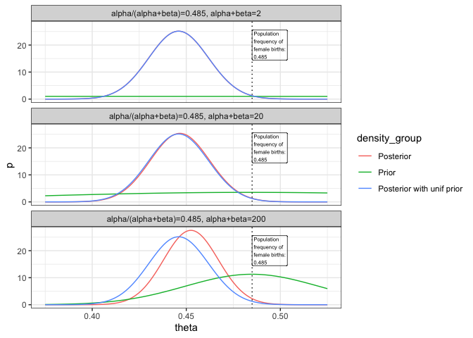

# Bayesian: Part 2 Probability of a girl birth given placenta previa

Last update:

    ## [1] "2024-11-29"

This doc was built with:
`rmarkdown::render("Bayesian_example2.Rmd", output_file = "../pages/bayesian_example2.md")`

## Introduction to part 2

The code is based on a version by Aki Vehtari.

In the continuation of the analysis on placenta previa, we look at
different priors to understand their impact on the posterior
distribution. This part not only revisits the basic steps introduced in
Part 1 but also expands on them by exploring alternative prior settings
to illustrate the sensitivity of our posterior estimates to the choice
of prior.

Following the initial setup where we determined the posterior
distribution using a uniform prior, Part 2 investigates how different
priors influence the results. This is crucial for assessing the
robustness of our conclusions against the assumptions we make in our
Bayesian framework.

- $$X = 437$$ - number of female births in placenta previa
- $$Y = 543$$ - number of male births in placenta previa
- $$n = 980$$ - total births in placenta previa
- $$0.485$$ - the frequency of normal female births in the population
- As in part 1, we had a posterior Beta(438,544)

``` r
a <- 437 # girls
b <- 543 # boys
```

## Exploring the effect of different priors

**Density evaluation**: We calculate the density of the posterior
distribution over a range of theta values using a uniform prior for
simplicity.

``` r
# Evaluate densities at evenly spaced points between 0.375 and 0.525
df1 <- data.frame(theta = seq(0.375, 0.525, 0.001))

# Posterior with Beta(1,1), ie. uniform prior
df1$pu <- dbeta(df1$theta, a+1, b+1)
```

**Further prior variations**: We set up priors with varying strengths by
modifying the prior counts and success ratio, reflecting different
degrees of confidence in the prior information.

``` r
# 3 different choices for priors
# Beta(0.485*2,(1-0.485)*2)
# Beta(0.485*20,(1-0.485)*20)
# Beta(0.485*200,(1-0.485)*200)
n <- c(2, 20, 200) # prior counts
apr <- 0.485 # prior ratio of success
```

- **Beta distribution parameters**: These parameters are set to reflect
  increasing confidence in prior information, with the product of 0.485
  and multipliers (2, 20, 200) determining the strength of the prior
  belief. This adjustment in parameters influences how much the prior
  beliefs affect the Bayesian updating process.
- **Prior counts (`n`)**: Specifies the strength of the prior. Lower
  counts like 2 suggest minimal prior influence, while higher counts
  like 200 indicate a strong prior belief based on substantial evidence
  or confidence.
- **Prior probability of success (`apr`)**: Represents an assumed rate
  of female births, serving as the basis for setting the Beta
  distribution parameters, thereby impacting the shape of the posterior
  distribution.

This setup allows for the examination of how prior beliefs, quantified
by `n` and `apr`, impact the posterior estimates. By varying these
priors, we see the Bayesian framework’s sensitivity to initial
assumptions, highlighting the need for careful consideration of prior
information in Bayesian analysis.

The following helper function and lapply construct compile the dataset
as described: helperf computes prior and posterior densities for a range
of theta values based on varying strengths of prior beliefs. This is
combined using lapply across different prior settings, and the results
are consolidated and reshaped for plotting

``` r
# helperf returns for given number of prior observations, prior ratio
# of successes, number of observed successes and failures and a data
# frame with values of theta, a new data frame with prior and posterior
# values evaluated at points theta.
helperf <- function(n, apr, a, b, df)
  cbind(df, pr = dbeta(df$theta, n*apr, n*(1-apr)), po = dbeta(df$theta, n*apr + a, n*(1-apr) + b), n = n)

# lapply function over prior counts n and pivot results into key-value pairs.
df2 <- lapply(n, helperf, apr, a, b, df1) %>%
  do.call(rbind, args = .) %>%
  pivot_longer(!c(theta, n), names_to = "density_group", values_to = "p") %>%
  mutate(density_group = factor(density_group, labels=c('Posterior','Prior','Posterior with unif prior')))

# add correct labels for plotting
df2$title <- factor(paste0('alpha/(alpha+beta)=0.485, alpha+beta=',df2$n))
```

``` r
# Plot distributions
ggplot(data = df2) +
  geom_line(aes(theta, p, color = density_group)) +
      # proportion of girl babies in general population
  geom_vline(xintercept = pop_freq, linetype='dotted') +
  annotate(geom = "label", label = lab_pop, x = pop_freq, y = 20, hjust = 0, fill = "white",  alpha = 0.5, size =2) +
  facet_wrap(~title, ncol = 1)
```

<!-- -->

The resulting plots highlight how the choice of prior affects the
posterior, with visual cues like vertical lines at the prior mean and
faceting by scenario.

## Conclusion

The exploration in part 2 demonstrates the Bayesian framework’s
flexibility and the critical role of prior selection. By comparing
different priors, we see how prior beliefs can substantially influence
posterior outcomes, thereby affecting conclusions drawn from Bayesian
analysis.
