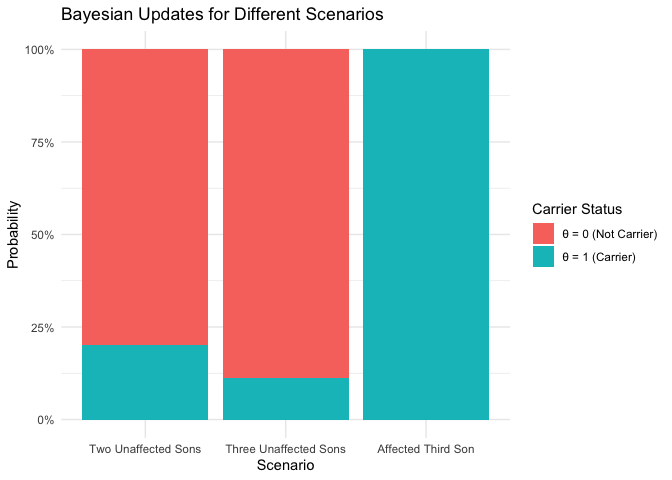

# Bayesian: Discrete probability example in genetics

Last update:

    ## [1] "2024-11-29"

This doc was built with:
`rmarkdown::render("bayesian_genetic_carrier.Rmd", output_file = "../pages/bayesian_genetic_carrier.md")`

# Inference about Genetic Status

## Background

Human males have one X-chromosome and one Y-chromosome, whereas females
have two X-chromosomes, each chromosome being inherited from one parent.
Hemophilia is a disease that exhibits X-chromosome-linked recessive
inheritance, meaning that a male who inherits the gene that causes the
disease on the X-chromosome is affected, whereas a female carrying the
gene on only one of her two X-chromosomes is not affected. The disease
is generally fatal for women who inherit two such genes, and this is
rare, since the frequency of occurrence of the gene is low in human
populations.

## Prior Distribution

Consider a woman who has an affected brother. This implies her mother
must be a carrier of the hemophilia gene, possessing one ‘good’ and one
‘bad’ hemophilia gene. We also know her father is not affected;
therefore, the woman herself has a fifty-fifty chance of being a carrier
of the gene. The unknown quantity of interest, the state of the woman,
has just two possible values: - $$\theta = 1$$: The woman is a carrier
of the gene. - $$\theta = 0$$: The woman is not a carrier of the gene.

Based on the information provided thus far, the prior distribution for
the unknown $$\theta$$ can be expressed with equal probabilities for
being a carrier or not:

$$
\Pr(\theta = 1) = \Pr(\theta = 0) = 0.5
$$

## Data Model and Likelihood

The data used to update the prior information consist of the affection
status of the woman’s sons. Suppose she has two sons, neither of whom is
affected. Let $$y_i = 1$$ or $$0$$ denote an affected or unaffected son,
respectively. The outcomes of the two sons are exchangeable and,
conditional on the unknown $$\theta$$, are independent; we assume the
sons are not identical twins.

The likelihood function based on the outcome where neither son is
affected is given by:

- $$\Pr(y_1 = 0, y_2 = 0 | \theta = 1) = (0.5)(0.5) = 0.25$$
- $$\Pr(y_1 = 0, y_2 = 0 | \theta = 0) = (1)(1) = 1$$

These expressions arise from the fact that if the woman is a carrier
($$\theta = 1$$), each of her sons has a 50% chance of inheriting the
gene and thus being affected. Conversely, if she is not a carrier
($$\theta = 0$$), the probability is close to 1 that her sons will be
unaffected. We ignore the small probability of being affected even if
the mother is not a carrier for this example.

## Posterior Distribution After Observing Two Unaffected Sons

Using Bayes’ rule, we combine the likelihoods with the prior
probabilities to determine the posterior probability that the woman is a
carrier, denoted as $$\theta = 1$$, given the data
$$y = (y_1 = 0, y_2 = 0)$$:

$$
\Pr(\theta = 1 | y_1, y_2) = \frac{\Pr(y_1 = 0, y_2 = 0 | \theta = 1) \Pr(\theta = 1)}{\Pr(y_1 = 0, y_2 = 0 | \theta = 1) \Pr(\theta = 1) + \Pr(y_1 = 0, y_2 = 0 | \theta = 0) \Pr(\theta = 0)}
$$

Substituting the values:

$$
\Pr(\theta = 1 | y_1, y_2) = \frac{0.25 \times 0.5}{0.25 \times 0.5 + 1 \times 0.5} = \frac{0.125}{0.625} = 0.20
$$

Or more simply: $$
\Pr(\theta = 1 | y) = \frac{\Pr(y | \theta = 1) \Pr(\theta = 1)}{\Pr(y | \theta = 1) \Pr(\theta = 1) + \Pr(y | \theta = 0) \Pr(\theta = 0)}
$$

Substituting the values:

$$
\Pr(\theta = 1 | y) = \frac{0.25 \times 0.5}{0.25 \times 0.5 + 1 \times 0.5} = \frac{0.125}{0.625} = 0.20
$$

This calculation intuitively suggests that it is less probable for the
woman to be a carrier if her children are unaffected. Bayes’ rule
provides a formal mechanism for this correction. The results can also be
expressed in terms of odds:

- **Prior odds**: $$0.5 / 0.5 = 1$$
- **Likelihood ratio** (based on the information about her two
  unaffected sons): $$0.25 / 1 = 0.25$$
- **Posterior odds**: $$1 \times 0.25 = 0.25$$

Converting back to probability:

$$
\frac{0.25}{1 + 0.25} = 0.2
$$

The posterior probability that the woman is a carrier is thus 20%, which
adjusts the prior belief based on the outcomes of her sons. Conversely,
the probability that she is not a carrier is updated to:

$$
\Pr(\theta = 0 | y_1, y_2) = 0.80
$$

This posterior probability now serves as the new prior for further
analysis if additional data is considered.

## Adding More Data

A key aspect of Bayesian analysis is the ease with which sequential
analyses can be performed. For example, suppose that the woman has a
third son, who is also unaffected. The entire calculation does not need
to be redone; rather, we use the previous posterior distribution as the
new prior distribution, to update our belief about the woman’s carrier
status.

### Updating with an Unaffected Third Son

If the third son is also unaffected, the likelihood for $$\theta = 1$$
is $0.5$ (probability that the son does not inherit the gene if the
mother is a carrier). The likelihood for $$\theta = 0$$ (probability
that the son does not inherit the gene if the mother is not a carrier)
remains 1, given the genetic condition being recessive.

Using the posterior from the previous calculation as the new prior, the
Bayesian update would be:

$$
\Pr(\theta = 1 | y_1, y_2, y_3) = \frac{\Pr(y_3 = 0 | \theta = 1) \times \Pr(\theta = 1 | y_1, y_2)}{\Pr(y_3 = 0 | \theta = 1) \times \Pr(\theta = 1 | y_1, y_2) + \Pr(y_3 = 0 | \theta = 0) \times \Pr(\theta = 0 | y_1, y_2)}
$$

Plugging in the values:

$$
\Pr(\theta = 1 | y_1, y_2, y_3) = \frac{0.5 \times 0.20}{0.5 \times 0.20 + 1 \times 0.80} = \frac{0.10}{0.10 + 0.80} = \frac{0.10}{0.90} \approx 0.111
$$

### Updating with an Affected Third Son

Conversely, if the third son is affected, the likelihood of him being
affected given that his mother is a carrier ($$\theta = 1$$) is again
0.5. However, the likelihood of him being affected given that his mother
is not a carrier ($$\theta = 0$$) is practically 0, considering the
genetic condition is recessive and assuming we ignore the small mutation
rate.

The update for the Bayesian analysis would therefore be:

$$
\Pr(\theta = 1 | y_1, y_2, y_3) = \frac{\Pr(y_3 = 1 | \theta = 1) \times \Pr(\theta = 1 | y_1, y_2)}{\Pr(y_3 = 1 | \theta = 1) \times \Pr(\theta = 1 | y_1, y_2) + \Pr(y_3 = 1 | \theta = 0) \times \Pr(\theta = 0 | y_1, y_2)}
$$

Given the values:

$$
\Pr(\theta = 1 | y_1, y_2, y_3) = \frac{0.5 \times 0.20}{0.5 \times 0.20 + 0 \times 0.80} = \frac{0.10}{0.10 + 0.00} = 1
$$

This result reflects the significant impact of observing an affected
child in a scenario where the mother’s carrier status was uncertain. If
the third son is affected, it conclusively indicates that the woman is a
carrier of the hemophilia gene. The probability of the woman being a
carrier thus becomes 1, showcasing the power of Bayesian updating when
integrating decisive new evidence.

## Dataset and visualisation

``` r
library(ggplot2)

# Data for two unaffected sons
all_probs <- data.frame(
  Theta = c("θ = 1 (Carrier)", "θ = 0 (Not Carrier)"),
  Probability = c(0.20, 0.80),  # Posterior probabilities after observing two unaffected sons
  Scenario = "Two Unaffected Sons"
)

# Data for three unaffected sons - update these probabilities based on your extended analysis
all_probs_three_sons <- data.frame(
  Theta = c("θ = 1 (Carrier)", "θ = 0 (Not Carrier)"),
  Probability = c(0.111, 0.889),  # Update based on your analysis
  Scenario = "Three Unaffected Sons"
)

# Data for third son affected - hypothetical scenario where the third son is affected
all_probs_affected_third_son <- data.frame(
  Theta = c("θ = 1 (Carrier)", "θ = 0 (Not Carrier)"),
  Probability = c(1, 0),  # Hypothetical update if the third son is affected
  Scenario = "Affected Third Son"
)

# Combine all data frames for unified plotting later
all_data <- rbind(
  all_probs,
  all_probs_three_sons,
  all_probs_affected_third_son
)
all_data$Scenario <- factor(all_data$Scenario, levels = c("Two Unaffected Sons", "Three Unaffected Sons", "Affected Third Son"))
```

| Theta               | Probability | Scenario              |
|:--------------------|------------:|:----------------------|
| θ = 1 (Carrier)     |       0.200 | Two Unaffected Sons   |
| θ = 0 (Not Carrier) |       0.800 | Two Unaffected Sons   |
| θ = 1 (Carrier)     |       0.111 | Three Unaffected Sons |
| θ = 0 (Not Carrier) |       0.889 | Three Unaffected Sons |
| θ = 1 (Carrier)     |       1.000 | Affected Third Son    |
| θ = 0 (Not Carrier) |       0.000 | Affected Third Son    |

all_data - Probabilities table

``` r
plot_bayesian_updates <- function(data) {
  ggplot(data, aes(x = Scenario, y = Probability, fill = Theta)) +
    geom_bar(stat = "identity", position = "fill") +
    scale_y_continuous(labels = scales::percent_format()) +
    labs(x = "Scenario", y = "Probability", fill = "Carrier Status") +
    ggtitle("Bayesian Updates for Different Scenarios") +
    theme_minimal()
}

# Plotting the combined data
plot_bayesian_updates(all_data)
```

<!-- -->
