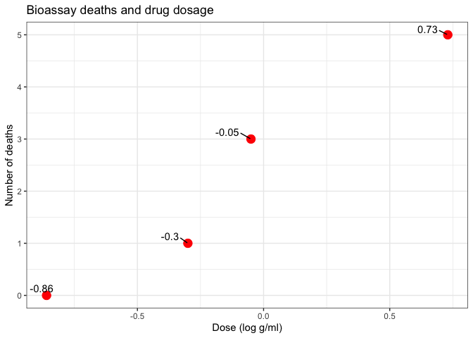
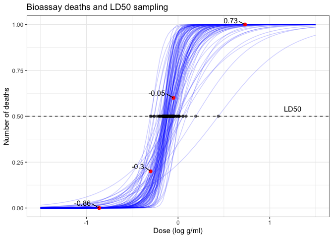
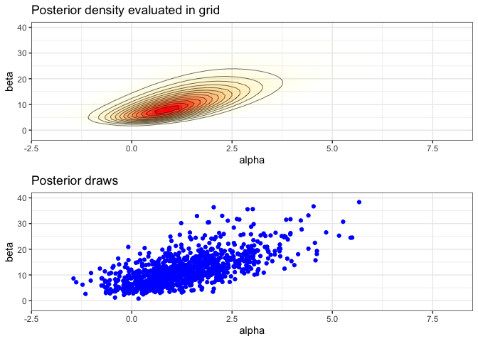
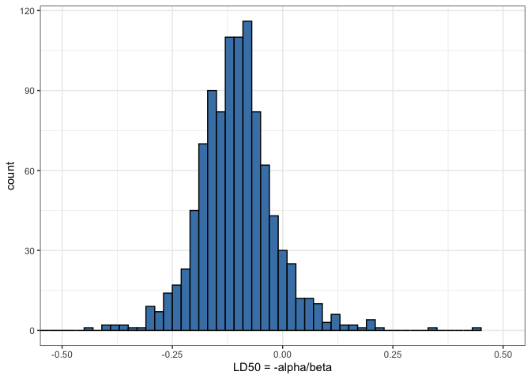

# Bayesian: Multiparameter binomial regression and grid sampling for bioassay data

Last update:

    ## [1] "2024-12-04"

This doc was built with:
`rmarkdown::render("bayesian_demo3_6.Rmd", output_file = "../pages/bayesian_multiparameter_bioassay.md")`

This example is described in the textbook: Bayesian Data Analysis, by
Andrew Gelman, John Carlin, Hal Stern, David Dunson, Aki Vehtari, and
Donald Rubin. Third edition, (BDA3),
<http://www.stat.columbia.edu/~gelman/book/>, chapter 3.7 (BDA3 p. 74-).
The code is based on a version by Aki Vehtari.

``` r
library(ggplot2); theme_set(theme_bw())
library(gridExtra)
library(tidyr)
library(dplyr)
library(purrr)
```

## Introduction

This document explores the Bayesian approach for analysing bioassay
data, focusing on estimating the toxicity of chemical compounds through
a two-parameter logistic regression model. This analysis typifies
non-conjugate scenarios in multiparameter problems where exact solutions
are impractical, using a discretised approximation for the posterior
distribution.

The Bayesian approach enhances LD50 estimation, the key toxicological
benchmark indicating a 50% fatality risk. **Unlike traditional methods
that rely on single-point estimates, this method employs a probabilistic
framework, yielding a detailed distribution of potential outcomes. This
not only provides a more nuanced understanding of toxicity but also aids
regulatory bodies in establishing more precise and dependable safety
thresholds**.

## The scientific problem and the data

Bioassay experiments are crucial in determining the lethal dosage of
drugs and chemicals. The data structure for such experiments involves
dose-response information where each observation unit corresponds to a
different dose level administered to groups of subjects, recording the
number of fatalities.

### Data overview

- x = dose_level (drug)
- n = n_animals (subjects)
- y = n_deaths (bad outcomes)

``` r
df1 <- data.frame(
  x = c(-0.86, -0.30, -0.05, 0.73),
  n = c(5, 5, 5, 5),
  y = c(0, 1, 3, 5)
)

print(df1)
```

    ##       x n y
    ## 1 -0.86 5 0
    ## 2 -0.30 5 1
    ## 3 -0.05 5 3
    ## 4  0.73 5 5

Plot data

``` r
ggplot(df1, aes(x=x, y=y)) +
    geom_point(size=4, color='red') +
    ggrepel::geom_text_repel(aes(label=x), vjust=-0.5, hjust=1.5, color='black') +
    labs(title = 'Bioassay deaths and drug dosage', x = 'Dose (log g/ml)', y = 'Number of deaths') 
```

<!-- -->

### Model specification

The responses within each dose group are modelled as binomially
distributed, reflecting the probabilistic nature of the observed
outcomes. Each response probability, $$\theta_i$$, depends on the dose,
reinforcing the assumption that the likelihood of a positive outcome
follows a binomial distribution conditioned on the dose level and
response probability.

## Modeling the dose–response relation

In this analysis, we model the dose-response relationship using a
logistic regression framework, which assumes that the log odds of death,
$$ \log\left(\frac{\theta_i}{1-\theta_i}\right) $$, are linearly related
to the dose levels. This approach allows the response probabilities to
vary between 0 and 1, accommodating the binary nature of the outcomes
(e.g., survival or death).

The relationship is defined mathematically as:

$$
\text{logit}(\theta_i) = \alpha + \beta x_i
$$

where $$ \theta_i $$ is the probability of death given dose $$ x_i $$,
and $$ \alpha $$ and $$ \beta $$ are parameters to be estimated.

### Likelihood specification

The likelihood for each group $$ i $$ under the model is defined as
follows:

$$
p(y_i | \alpha, \beta, n_i, x_i) \propto [\text{logit}^{-1}(\alpha + \beta x_i)]^{y_i} [1 - \text{logit}^{-1}(\alpha + \beta x_i)]^{n_i - y_i}
$$

where $$ y_i $$ is the number of deaths among $$ n_i $$ subjects at dose
level $$ x_i $$. This specification assumes that the outcomes within
each group are independent and identically distributed, following a
binomial distribution.

### Prior distribution and independence assumptions

We adopt a noninformative prior distribution for the parameters, uniform
over the parameter space, expressed as $$ p(\alpha, \beta) \propto 1 $$.
This choice reflects a lack of prior knowledge about the parameters and
facilitates an objective analysis based primarily on the data.

Furthermore, the assumption of independence among the responses within
each group supports the use of the binomial model. This assumption is
reasonable unless there is evidence of interaction effects among
subjects within the same dose group, such as contagion in the event of
disease transmission.

### Model justification and adjustments

Given that $$ \alpha $$ and $$ \beta $$ directly influence
$$ \theta_i $$ through the logistic function, it is crucial that the
model accounts for the bounded nature of probabilities. The logistic
transformation ensures that the estimated probabilities remain within
the \[0,1\] interval, regardless of the values taken by the linear
combination $$ \alpha + \beta x_i $$.

This modeling framework effectively captures the systematic variation in
death probabilities as a function of dose, providing a robust tool for
analyzing bioassay data. The analysis includes fixing the sample sizes
$$ n_i $$ and dose levels $$ x_i $$ as constants, focusing the inference
solely on the parameters $$ \alpha $$ and $$ \beta $$.

By employing this structured approach, we can interpret the parameters’
effects on the probability of death and make informed decisions about
safe dose levels based on the computed LD50, the dose at which the death
probability is 50%.

## Computational Setup for Bayesian Inference (grid for posterior computation)

Here, we set up a grid over the parameter space and calculate the
posterior distribution across this grid. To perform Bayesian inference,
we establish a grid over the logistic model parameters, systematically
evaluating the posterior distribution across a spectrum of values. This
grid approach is essential for approximating the posterior where
analytical solutions are unattainable.

Compute the posterior density in grid.

- usually should be computed in logarithms!
- with alternative prior, check that range and spacing of A and B are
  sensible

``` r
A = seq(-4, 8, length.out = 50)
B = seq(-10, 40, length.out = 50)
```

Making vectors that contain all pairwise combinations of A and B

``` r
cA <- rep(A, each = length(B))
cB <- rep(B, length(A))
```

We define a helper function to calculate the log-likelihood, then apply
it across our dataset to estimate the joint likelihood over the grid.
This helper function will calculate the log likelihood given a dataframe
with x, y, and n and evaluation points a and b. For the likelihood see
BDA3 p. 75<br> `log1p(x)` computes log(x+1) in numerically more stable
way.

``` r
logl <- function(df, a, b)
  df['y']*(a + b*df['x']) - df['n']*log1p(exp(a + b*df['x']))
```

Calculating likelihood for each combination of parameters: apply logl
function for each observation ie. each row of data frame of x, n and y

``` r
p <- apply(df1, 1, logl, cA, cB) %>%
  # sum the log likelihoods of observations
  # and exponentiate to get the joint likelihood
  rowSums() %>% exp()

# Convert log-likelihoods to likelihoods and normalise to obtain posterior probabilities
```

## Sampling from the posterior distribution

We approximate the Bayesian posterior by sampling from the grid, with
each sample weighted by its likelihood. Adding random jitter to these
samples enhances the continuity of our estimates, facilitating more
robust inference from our discrete approximation.

We follow a detailed procedure to sample from the grid, ensuring that
each step contributes to an accurate representation of the posterior
distribution:

1.  **Compute Marginal Posterior Distributions**: We start by
    calculating the marginal posterior distribution for $$\alpha$$ by
    numerically summing over all possible values of $$\beta$$ in the
    grid. This step aggregates the contributions of each $$\beta$$ value
    to the probability of $$\alpha$$, forming a comprehensive view of
    $$\alpha$$’s likelihood given the data.

2.  **Sampling Steps**:

    - For each of the 1000 iterations (s = 1 to 1000):
      - **a. Draw $$\alpha_s$$**: Sample $$\alpha$$ values from the
        discretely computed marginal distribution $$p(\alpha | y)$$.
        This sampling can be seen as a discrete analogue of the inverse
        cumulative distribution function (CDF) method, ensuring that our
        samples are drawn according to their computed probabilities.
      - **b. Draw $$\beta_s$$**: For each $$\alpha_s$$ drawn, sample
        $$\beta_s$$ from the conditional distribution
        $$p(\beta | \alpha, y)$$, reflecting the dependency of $$\beta$$
        on the sampled values of $$\alpha$$.
      - **c. Add Jitter**: To each sampled pair $$(\alpha_s, \beta_s)$$,
        add a uniform random jitter centered at zero. The jitter width
        is set to half the spacing between grid points, smoothing the
        transition between discrete grid points and creating a more
        continuous distribution.

### Sample from the grid (with replacement)

Sample from the grid, with replacement, (the posterior distribution) to
approximate Bayesian estimates and adding jitter for plot continuity.

``` r
nsamp <- 1000
samp_indices <- sample(length(p), size = nsamp,
                       replace = T, prob = p/sum(p))
samp_A <- cA[samp_indices[1:nsamp]]
samp_B <- cB[samp_indices[1:nsamp]]
```

Add random jitter, see BDA3 p. 76

``` r
samp_A <- samp_A + runif(nsamp, (A[1] - A[2])/2, (A[2] - A[1])/2)
samp_B <- samp_B + runif(nsamp, (B[1] - B[2])/2, (B[2] - B[1])/2)

head(samp_A)
```

    ## [1] 1.8361911 0.5603304 0.6314775 1.2997661 1.9234143 0.1217990

``` r
head(samp_B)
```

    ## [1] 20.861506  9.061151 10.383111 10.018550 12.449213  8.442394

### Analysing LD50 and its challenges

We create a dataframe for plots and visualising the logistic regression
curves. This contains the sampled parameter values and corresponding
LD50 calculations.

A critical measure in bioassay studies is the LD50, the dose level at
which the probability of death is 50%. We compute this from the model
parameters and address the interpretative challenges when the
dose-response relationship might not be monotonically increasing,
particularly when $$\beta \leq 0$$.

``` r
samps <- data_frame(ind = 1:nsamp, alpha = samp_A, beta = samp_B) %>%
  mutate(ld50 = - alpha/beta)

head(samps)
```

    ## # A tibble: 6 × 4
    ##     ind alpha  beta    ld50
    ##   <int> <dbl> <dbl>   <dbl>
    ## 1     1 1.84  20.9  -0.0880
    ## 2     2 0.560  9.06 -0.0618
    ## 3     3 0.631 10.4  -0.0608
    ## 4     4 1.30  10.0  -0.130 
    ## 5     5 1.92  12.4  -0.155 
    ## 6     6 0.122  8.44 -0.0144

## Plot draws of logistic curves

We compile various visualisations, including logistic regression curves
and the distribution of LD50 estimates, to interpret the model’s
effectiveness and the implications of the parameters. These
visualisations underscore the variability and uncertainty in the
parameter estimates, providing a comprehensive view of the Bayesian
inference process.

``` r
invlogit <- plogis
xr <- seq(-1.5, 1.5, length.out = 100)
dff <- pmap_df(samps[1:100,], ~ data_frame(x = xr, id=..1,
                                   f = invlogit(..2 + ..3*x)))
ppost <- ggplot(df1, aes(x=x, y=y/n)) +
  geom_line(data=dff, aes(x=x, y=f, group=id), linetype=1, color='blue', alpha=0.2) +
  geom_point(size=2, color='red') +
  # scale_x_continuous(breaks = df1$x, minor_breaks=NULL, limits = c(-1.5, 1.5)) +
  # scale_y_continuous(breaks = seq(0,1,length.out=3), minor_breaks=NULL) +
  labs(title = 'Bioassay', x = 'Dose (log g/ml)', y = 'Proportion of deaths') +
    ggrepel::geom_text_repel(aes(label=x), vjust=-0.5, hjust=1.5, color='black') +
    labs(title = 'Bioassay deaths and LD50 sampling', x = 'Dose (log g/ml)', y = 'Number of deaths') 
```

add 50% deaths line and LD50 dots

``` r
ppost + geom_hline(yintercept = 0.5, linetype = 'dashed', color = 'grey20') +
  geom_point(data=samps[1:100,], aes(x=ld50, y=0.5), color='black', alpha=0.5) +
  annotate(geom = "text", x = 1.25, y = 0.54, label = "LD50")
```

<!-- -->

Create a plot of the posterior density

``` r
# limits for the plots
xl <- c(-2, 8)
yl <- c(-2, 40)
pos <- ggplot(data = data.frame(cA ,cB, p), aes(cA, cB)) +
  geom_raster(aes(fill = p, alpha = p), interpolate = T) +
  geom_contour(aes(z = p), colour = 'black', size = 0.2) +
  coord_cartesian(xlim = xl, ylim = yl) +
  labs(title = 'Posterior density evaluated in grid', x = 'alpha', y = 'beta') +
  scale_fill_gradient(low = 'yellow', high = 'red', guide = F) +
  scale_alpha(range = c(0, 1), guide = F)
```

Plot of the samples

``` r
sam <- ggplot(data = samps) +
  geom_point(aes(alpha, beta), color = 'blue') +
  coord_cartesian(xlim = xl, ylim = yl) +
  labs(title = 'Posterior draws', x = 'alpha', y = 'beta')
```

Combine the plots

``` r
grid.arrange(pos, sam, nrow=2)
```

<!-- -->

## Plot of the histogram of LD50

``` r
his <- ggplot(data = samps) +
  geom_histogram(aes(ld50), binwidth = 0.02,
                 fill = 'steelblue', color = 'black') +
  coord_cartesian(xlim = c(-0.5, 0.5)) +
  labs(x = 'LD50 = -alpha/beta')
his
```

<!-- -->

## Posterior summaries and decision making

### Interpreting LD50 estimates

The LD50, or the dose at which there is a 50% chance of a fatal outcome,
is a crucial metric in toxicology. It serves as a benchmark for
regulatory bodies to set safe exposure levels. By computing LD50 from
our Bayesian model, we provide a probabilistic assessment of toxicity,
which is more informative than single-point estimates derived from
frequentist methods.

In this analysis, LD50 values are derived from the distribution of the
sampled parameters, alpha and beta. These parameters are estimated from
the logistic regression model, reflecting how the probability of death
changes with dosage. The variability in these estimates, illustrated in
our histograms and scatter plots, reflects the uncertainty inherent in
experimental data and model assumptions.

### Decision making implications

The distribution of LD50 values aids regulatory decision-making by
quantifying the risk associated with different dosage levels. Regulators
can use this information to determine safe dosage limits, balancing
efficacy against potential harm. For instance, if the posterior
probability of LD50 being below a certain threshold is high, it may
suggest that the drug can be considered relatively safe up to that
threshold. Conversely, a wide spread in the LD50 estimates may indicate
the need for additional studies or more conservative dosage
recommendations.

### Practical considerations

The Bayesian approach offers several advantages for decision-making: -
**Probabilistic nature**: It provides a full probability distribution of
outcomes, allowing for a nuanced understanding of risk. -
**Incorporation of prior information**: Prior clinical data or expert
opinion can be formally incorporated, enhancing the robustness of the
inference. - **Flexibility in model specifications**: Bayesian models
can be easily extended to include more complex relationships or
hierarchical structures, which can be crucial for multi-phase trials.

### Regulatory and ethical considerations

Regulatory decisions based on LD50 estimates must also consider ethical
implications, especially in terms of acceptable risk levels. The
Bayesian framework’s flexibility allows for the explicit inclusion of
ethical considerations into the model, such as different weights to
outcomes based on severity.

This comprehensive approach ensures that drug approval and dosage
recommendations are based on a thorough understanding of both
statistical evidence and practical implications, leading to safer and
more effective therapeutic interventions.
