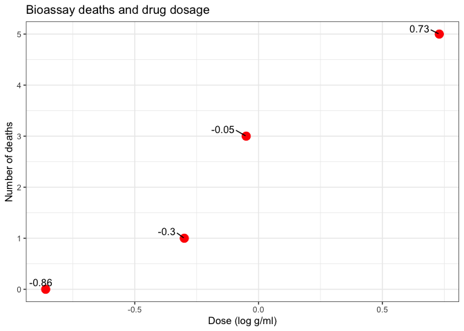
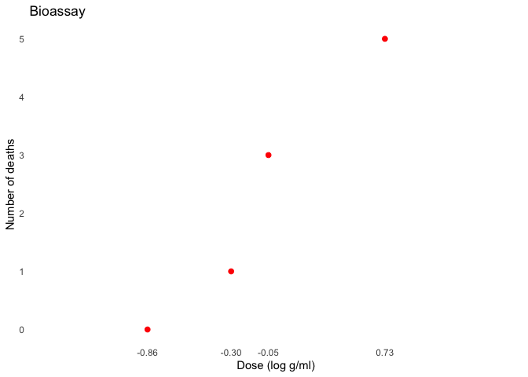
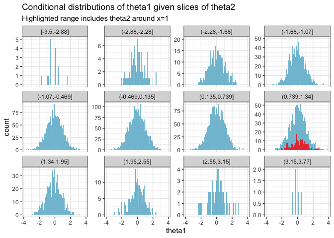

# Bayes multiparameter models

Last update:

    ## [1] "2024-11-30"

This doc was built with:
`rmarkdown::render("bayesian_demo3_1_4.Rmd", output_file = "../pages/bayesian_multiparameter_models.md")`

This example is described in the textbook: Bayesian Data Analysis, by
Andrew Gelman, John Carlin, Hal Stern, David Dunson, Aki Vehtari, and
Donald Rubin. Third edition, (BDA3),
<http://www.stat.columbia.edu/~gelman/book/>, chapter 3. The code is
based on a version by Aki Vehtari and Markus Paasiniemi.

- **Section 3.2**: Discusses the normal distribution with unknown mean
  and variance.
- **Sections 3.4 and 3.5**: Address inference for the multinomial and
  multivariate normal distributions, the simplest models for discrete
  and continuous multivariate data, respectively.
- **Conclusion**: The chapter concludes with an examination of a
  nonconjugate logistic regression model, implemented via numerical
  computation of the posterior density on a grid.

## Introduction to nuisance parameters in Bayesian statistics

In the realm of statistics, nearly every practical problem encompasses
multiple unknown or unobservable quantities. The simplicity of the
Bayesian approach shines when managing such complexities, offering clear
advantages over alternative methods of inference. Often, although a
problem may present several parameters of interest, attention is usually
focused on just one or a few.

{: .important-title }

> Definitions
>
> **Marginal posterior distribution**: The probability distribution of
> the parameters of interest, obtained by integrating out the nuisance
> parameters from the joint posterior distribution.
>
> **Nuisance parameters**: Parameters included in the model to enhance
> its realism and validity, though they are not the primary focus of
> analysis.
>
> **Joint posterior distribution**: The probability distribution
> representing the likelihood of all parameter values given the observed
> data.

### Aim of Bayesian analysis

The primary goal of Bayesian analysis is to determine the marginal
posterior distribution of the parameters of interest. This is achieved
through a two-step process:

1.  **Obtaining the joint posterior distribution**: Initially, the
    complete joint posterior distribution encompassing all unknowns is
    required.
2.  **Integrating over nuisance parameters**: Subsequently, this
    distribution is integrated over the parameters that are not of
    immediate interest, yielding the desired marginal distribution.

$$
p(\theta_1 \mid y) = \int p(\theta_1, \theta_2 \mid y) \, d\theta_2
$$

Alternatively, by using simulation:

3.  **Simulation sampling**: Samples are drawn from the joint posterior
    distribution, concentrating on the parameters of interest and
    disregarding the values of other unknowns.

### Nuisance parameters

Frequently in statistical problems, many parameters, although essential
for constructing a realistic model, are not the focus of inference.
These parameters are typically referred to as *nuisance parameters*.

**Example**: An exemplary instance of nuisance parameters is the scale
of random errors in measurement problems.

## Averaging over ‘Nuisance Parameters’

{: .important-title }

> Explanation of symbols
>
> $$\theta$$: Total parameters of interest, split into two components
> $$\theta_1$$ and $$\theta_2$$.
>
> $$\theta_1$$ and $$\theta_2$$: $$\theta_1$$ represents parameters of
> primary interest, while $$\theta_2$$ represents nuisance parameters.
>
> $$y$$: Observed data.
>
> $$\mu$$ and $$\sigma^2$$: Parameters commonly used in normal
> distribution models, where $$\mu$$ is the mean and $$\sigma^2$$ is the
> variance.
>
> $$p(\theta_1 \mid y)$$: Marginal posterior distribution of
> $$\theta_1$$ given data $$y$$.
>
> $$p(\theta_1, \theta_2 \mid y)$$: Joint posterior distribution of
> $$\theta_1$$ and $$\theta_2$$ given data $$y$$.
>
> $$\mathcal{N}(\mu, \sigma^2)$$: Normal distribution with mean $$\mu$$
> and variance $$\sigma^2$$.

To express the ideas of joint and marginal posterior distributions
mathematically, suppose $$\theta$$ has two parts, each of which can be a
vector, $$\theta = (\theta_1, \theta_2)$$, and further suppose that we
are only interested (at least for the moment) in inference for
$$\theta_1$$, so $$\theta_2$$ may be considered a ‘nuisance’ parameter.
For instance, in the simple example,

$$
y \mid \mu, \sigma^2 \sim \mathcal{N}(\mu, \sigma^2),
$$

in which both $$\mu$$ (equivalent to $$\theta_1$$) and $$\sigma^2$$
(equivalent to $$\theta_2$$) are unknown, interest commonly centers on
$$\mu$$. We seek the conditional distribution of the parameter of
interest given the observed data; in this case, $$p(\theta_1 \mid y)$$.
This is derived from the joint posterior density,

$$
p(\theta_1, \theta_2 \mid y) \propto p(y \mid \theta_1, \theta_2)p(\theta_1, \theta_2),
$$

by averaging over $$\theta_2$$:

$$
p(\theta_1 \mid y) = \int p(\theta_1, \theta_2 \mid y) \, d\theta_2.
$$

Alternatively, the joint posterior density can be factored to yield

$$
\begin{equation}
p(\theta_1 \mid y) = \int Z p(\theta_1 \mid \theta_2, y) p(\theta_2 \mid y) d\theta_2, \tag{1}\label{eq:one}
\end{equation}
$$

which shows that the posterior distribution of interest,
$$p(\theta_1 \mid y)$$, is a mixture of the conditional posterior
distributions given the nuisance parameter, $$\theta_2$$, where
$$p(\theta_2 \mid y)$$ is a weighting function for the different
possible values of $$\theta_2$$. The weights depend on the posterior
density of $$\theta_2$$ and thus on a combination of evidence from data
and prior model. The averaging over nuisance parameters $$\theta_2$$ can
be interpreted generally; for example, $$\theta_2$$ can include a
discrete component representing different possible sub-models.

We rarely evaluate the integral (eqn \ref{eq:one}) explicitly, but it
suggests an important practical strategy for both constructing and
computing with multiparameter models. Posterior distributions can be
computed by marginal and conditional simulation, first drawing
$$\theta_2$$ from its marginal posterior distribution and then
$$\theta_1$$ from its conditional posterior distribution, given the
drawn value of $$\theta_2$$. In this way, the integration embodied in
(eqn \ref{eq:one}) is performed indirectly. A canonical example of this
form of analysis is provided by the normal model with unknown mean and
variance, to which we now turn.

### Explanation of averaging over nuisance parameters

Let’s break down the equation to show how the joint posterior
distribution is constructed from the likelihood and the prior
distribution.

#### Objective

To derive the marginal posterior distribution of $$\theta_1$$ by
integrating out $$\theta_2$$, considered a nuisance parameter, from the
joint posterior distribution.

#### Step-by-step breakdown

1.  **Joint posterior distribution**:
    - **Equation**: $$
      p(\theta_1, \theta_2 \mid y) \propto p(y \mid \theta_1, \theta_2) \times p(\theta_1, \theta_2)
      $$
    - **Explanation**: This formula shows the joint posterior
      distribution as a product of the likelihood of the data given the
      parameters and the prior beliefs about these parameters. The term
      “proportional to” indicates that after considering the likelihood
      and prior, the result must be normalised to ensure it sums to one
      across all possible values of $$\theta_1$$ and $$\theta_2$$.
2.  **Visual breakdown**:
    - **Prior layer**: Represents initial beliefs about the parameters
      before seeing the data.
    - **Likelihood layer**: Adjusts beliefs based on how likely the
      observed data is under various parameter values.
    - **Normalisation**: Ensures the total probability across all
      parameter values equals one.
3.  **Marginal posterior distribution**:
    - **Equation**: $$
      p(\theta_1 \mid y) = \int p(\theta_1, \theta_2 \mid y) \, d\theta_2
      $$
    - **Explanation**: By integrating out $$\theta_2$$, this operation
      focuses solely on $$\theta_1$$, summing over all potential
      influences of $$\theta_2$$ to isolate the effect on $$\theta_1$$.
      This represents averaging over all possible values of
      $$\theta_2$$, which adjusts $$\theta_1$$’s distribution to reflect
      its combined impact.
4.  **Factorisation and practical computation**:
    - **Equation**: $$
      p(\theta_1 \mid y) = \int Z p(\theta_1 \mid \theta_2, y) p(\theta_2 \mid y) d\theta_2
      $$
    - **Components**:
      - $$p(\theta_1 \mid \theta_2, y)$$: The conditional posterior of
        $$\theta_1$$ given $$\theta_2$$ and data.
      - $$p(\theta_2 \mid y)$$: Acts as a weighting function in the
        integration, representing the marginal posterior of
        $$\theta_2$$.
    - **Explanation**: This factorisation views the marginal posterior
      as a weighted average of conditional posteriors, emphasising a
      practical simulation-based method to handle complex integrations.
5.  **Simulation as a practical solution**:
    - **Procedure**:
      - **Draw $$\theta_2$$**: From its marginal posterior distribution.
      - **Draw $$\theta_1$$**: From the conditional distribution given
        the sampled $$\theta_2$$.
    - **Explanation**: This simulation effectively performs the
      integration by sampling, which is useful when direct computation
      is infeasible or impractical.

To visualise how these components come together, you can think of it as
layers:

- **Base layer (Prior distribution)**: Start with your initial beliefs
  about the parameters (before seeing the data).
- **Middle layer (Likelihood)**: Adjust these beliefs by the likelihood
  of the observed data under various parameter values.
- **Top layer (Normalisation)**: Scale the result so that the total
  probability across all parameter values equals 1.

### Step-by-step visualization

The goal of these visualizations is to explore the effects of the
nuisance parameter $$\theta_2$$ on the distribution of $$\theta_1$$. We
first observe the overall distribution of $$\theta_2$$ and then focus on
how specific values influence $$\theta_1$$.

#### Step 1: Visualizing the distribution of $$\theta_2$$

We start by drawing a histogram to understand the typical range and
distribution of $$\theta_2$$. This visualization helps identify the
common values and the spread of $$\theta_2$$. For detailed analysis, we
specifically highlight the bar at $$x = 1$$ to observe its frequency and
to mark it for further scrutiny.

``` r
# Simulate some data
set.seed(123)
data <- data.frame(
  theta1 = rnorm(10000),
  theta2 = rnorm(10000)
)
```

<!-- -->

<!-- -->

#### Step 2: Examining the effect of a highlighted $$\theta_2$$ on $$\theta_1$$

Next, we demonstrate how varying $$\theta_2$$ affects $$\theta_1$$ by
creating conditional histograms. We highlight the range around $$x = 1$$
to see how $$\theta_1$$ behaves when $$\theta_2$$ is near this specific
value. This step visualizes the conditional effects of $$\theta_2$$ on
$$\theta_1$$ across different slices, with a particular focus on the
highlighted region.

<!-- -->

Integrating out $$\theta_2$$ in Bayesian analysis is about marginalizing
over this parameter to refine our estimates for $$\theta_1$$. This
involves averaging over all possible values of $$\theta_2$$, where each
value is weighted by its likelihood:

- **Highlighting an example value**: By highlighting $$x = 1$$ in the
  visualizations, we’re not limiting our analysis to this point but
  rather using it to exemplify how specific values within the range of
  $$\theta_2$$ can influence the outcome for $$\theta_1$$. It serves as
  a focal point for comparison.
- **Complete integration**: The full integration over $$\theta_2$$
  considers every part of its distribution. Each histogram slice
  contributes to a comprehensive understanding of how $$\theta_1$$ is
  influenced by the entire spectrum of $$\theta_2$$.

## Normal model with unknown mean and variance (BDA3 section 3.2 on p. 64).

Multivariate joint distribution, conditional distribution, marginal
distribution, marginalization and posterior predictive distribution

ggplot2, grid, and gridExtra are used for plotting, tidyr for
manipulating data frames

#### Generic part common for Demos 3.1-3.4

Data

``` r
y <- c(93, 112, 122, 135, 122, 150, 118, 90, 124, 114)
```

Sufficient statistics

``` r
n <- length(y)
s2 <- var(y)
my <- mean(y)
```

Factorize the joint posterior p(mu,sigma2\|y) to
p(sigma2\|y)p(mu\|sigma2,y) Sample from the joint posterior using this
factorization

``` r
# helper functions to sample from and evaluate
# scaled inverse chi-squared distribution
rsinvchisq <- function(n, nu, s2, ...) nu*s2 / rchisq(n , nu, ...)
dsinvchisq <- function(x, nu, s2){
  exp(log(nu/2)*nu/2 - lgamma(nu/2) + log(s2)/2*nu - log(x)*(nu/2+1) - (nu*s2/2)/x)
}
```

Sample 1000 random numbers from p(sigma2\|y)

``` r
ns <- 1000
sigma2  <- rsinvchisq(ns, n-1, s2)
```

Sample from p(mu\|sigma2,y)

``` r
mu <- my + sqrt(sigma2/n)*rnorm(length(sigma2))
```

Create a variable sigma and sample from predictive distribution
p(ynew\|y) for each draw of (mu, sigma)

``` r
sigma <- sqrt(sigma2)
ynew <- rnorm(ns, mu, sigma)
```

For mu, sigma and ynew compute the density in a grid ranges for the
grids

``` r
t1l <- c(90, 150)
t2l <- c(10, 60)
nl <- c(50, 185)
t1 <- seq(t1l[1], t1l[2], length.out = ns)
t2 <- seq(t2l[1], t2l[2], length.out = ns)
xynew <- seq(nl[1], nl[2], length.out = ns)
```

Compute the exact marginal density of mu

``` r
# multiplication by 1./sqrt(s2/n) is due to the transformation of
# variable z=(x-mean(y))/sqrt(s2/n), see BDA3 p. 21
pm <- dt((t1-my) / sqrt(s2/n), n-1) / sqrt(s2/n)
```

Estimate the marginal density using samples and ad hoc Gaussian kernel
approximation

``` r
pmk <- density(mu, adjust = 2, n = ns, from = t1l[1], to = t1l[2])$y
```

<!-- Compute the exact marginal density of sigma -->
<!-- ```{r } -->
<!-- # the multiplication by 2*t2 is due to the transformation of -->
<!-- # variable z=t2^2, see BDA3 p. 21 -->
<!-- ps <- dsinvchisq(t2^2, n-1, s2) * 2*t2 -->
<!-- ``` -->
<!-- Estimate the marginal density using samples -->
<!-- and ad hoc Gaussian kernel approximation -->
<!-- ```{r } -->
<!-- psk <- density(sigma, n = ns, from = t2l[1], to = t2l[2])$y -->
<!-- ``` -->
<!-- Compute the exact predictive density -->
<!-- ```{r } -->
<!-- # multiplication by 1./sqrt(s2/n) is due to the transformation of variable -->
<!-- # see BDA3 p. 21 -->
<!-- p_new <- dt((xynew-my) / sqrt(s2*(1+1/n)), n-1) / sqrt(s2*(1+1/n)) -->
<!-- ``` -->
<!-- Evaluate the joint density in a grid. -->
<!-- Note that the following is not normalized, but for plotting -->
<!-- contours it does not matter. -->
<!-- ```{r } -->
<!-- # Combine grid points into another data frame -->
<!-- # with all pairwise combinations -->
<!-- dfj <- data.frame(t1 = rep(t1, each = length(t2)), -->
<!--                   t2 = rep(t2, length(t1))) -->
<!-- dfj$z <- dsinvchisq(dfj$t2^2, n-1, s2) * 2*dfj$t2 * dnorm(dfj$t1, my, dfj$t2/sqrt(n)) -->
<!-- # breaks for plotting the contours -->
<!-- cl <- seq(1e-5, max(dfj$z), length.out = 6) -->
<!-- ``` -->
<!-- ### Demo 3.1 Visualise the joint and marginal densities -->
<!-- Visualise the joint density and marginal densities of the posterior -->
<!-- of normal distribution with unknown mean and variance. -->
<!-- Create a plot of the marginal density of mu -->
<!-- ```{r } -->
<!-- dfm <- data.frame(t1, Exact = pm, Empirical = pmk) %>% -->
<!--    pivot_longer(cols = !t1, names_to="grp", values_to="p") -->
<!-- margmu <- ggplot(dfm) + -->
<!--   geom_line(aes(t1, p, color = grp)) + -->
<!--   coord_cartesian(xlim = t1l) + -->
<!--   labs(title = 'Marginal of mu', x = '', y = '') + -->
<!--   scale_y_continuous(breaks = NULL) + -->
<!--   theme(legend.background = element_blank(), -->
<!--         legend.position = c(0.75, 0.8), -->
<!--         legend.title = element_blank()) -->
<!-- ``` -->
<!-- Create a plot of the marginal density of sigma -->
<!-- ```{r } -->
<!-- dfs <- data.frame(t2, Exact = ps, Empirical = psk) %>%  -->
<!--    pivot_longer(cols = !t2, names_to="grp", values_to="p") -->
<!-- margsig <- ggplot(dfs) + -->
<!--   geom_line(aes(t2, p, color = grp)) + -->
<!--   coord_cartesian(xlim = t2l) + -->
<!--   coord_flip() + -->
<!--   labs(title = 'Marginal of sigma', x = '', y = '') + -->
<!--   scale_y_continuous(breaks = NULL) + -->
<!--   theme(legend.background = element_blank(), -->
<!--         legend.position = c(0.75, 0.8), -->
<!--         legend.title = element_blank()) -->
<!-- ``` -->
<!-- Create a plot of the joint density -->
<!-- ```{r } -->
<!-- joint1labs <- c('Samples','Exact contour') -->
<!-- joint1 <- ggplot() + -->
<!--   geom_point(data = data.frame(mu,sigma), aes(mu, sigma, col = '1'), size = 0.1) + -->
<!--   geom_contour(data = dfj, aes(t1, t2, z = z, col = '2'), breaks = cl) + -->
<!--   coord_cartesian(xlim = t1l,ylim = t2l) + -->
<!--   labs(title = 'Joint posterior', x = '', y = '') + -->
<!--   scale_y_continuous(labels = NULL) + -->
<!--   scale_x_continuous(labels = NULL) + -->
<!--   scale_color_manual(values=c('blue', 'black'), labels = joint1labs) + -->
<!--   guides(color = guide_legend(nrow  = 1, override.aes = list( -->
<!--     shape = c(16, NA), linetype = c(0, 1), size = c(2, 1)))) + -->
<!--   theme(legend.background = element_blank(), -->
<!--         legend.position = c(0.5, 0.9), -->
<!--         legend.title = element_blank()) -->
<!-- ``` -->
<!-- Combine the plots -->
<!-- ```{r blank, fig.show='hide'} -->
<!-- # blank plot for combining the plots -->
<!-- bp <- grid.rect(gp = gpar(col = 'white')) -->
<!-- ``` -->
<!-- ```{r combined} -->
<!-- grid.arrange(joint1, margsig, margmu, bp, nrow = 2) -->
<!-- ``` -->
<!-- ### Demo 3.2 Visualise factored distribution -->
<!-- Visualise factored sampling and the corresponding -->
<!-- marginal and conditional densities. -->
<!-- Create another plot of the joint posterior -->
<!-- ```{r } -->
<!-- # data frame for the conditional of mu and marginal of sigma -->
<!-- dfc <- data.frame(mu = t1, marg = rep(sigma[1], length(t1)), -->
<!--                   cond = sigma[1] + dnorm(t1 ,my, sqrt(sigma2[1]/n)) * 100) %>% -->
<!--   pivot_longer(cols = c(marg,cond), names_to="grp", values_to="p") -->
<!-- # legend labels for the following plot -->
<!-- joint2labs <- c('Exact contour plot', 'Sample from joint post.', -->
<!--                'Cond. distribution of mu', 'Sample from the marg. of sigma') -->
<!-- joint2 <- ggplot() + -->
<!--   geom_contour(data = dfj, aes(t1, t2, z = z, col = '1'), breaks = cl) + -->
<!--   geom_point(data = data.frame(m = mu[1], s = sigma[1]), aes(m , s, color = '2')) + -->
<!--   geom_line(data = dfc, aes(mu, p, color = grp), linetype = 'dashed') + -->
<!--   coord_cartesian(xlim = t1l,ylim = t2l) + -->
<!--   labs(title = 'Joint posterior', x = '', y = '') + -->
<!--   scale_x_continuous(labels = NULL) + -->
<!--   scale_color_manual(values=c('blue', 'darkgreen','darkgreen','black'), labels = joint2labs) + -->
<!--   guides(color = guide_legend(nrow  = 2, override.aes = list( -->
<!--     shape = c(NA, 16, NA, NA), linetype = c(1, 0, 1, 1)))) + -->
<!--   theme(legend.background = element_blank(), -->
<!--         legend.position = c(0.5, 0.85), -->
<!--         legend.title = element_blank()) -->
<!-- ``` -->
<!-- Create another plot of the marginal density of sigma -->
<!-- ```{r } -->
<!-- margsig2 <- ggplot(data = data.frame(t2, ps)) + -->
<!--   geom_line(aes(t2, ps), color = 'blue') + -->
<!--   coord_cartesian(xlim = t2l) + -->
<!--   coord_flip() + -->
<!--   labs(title = 'Marginal of sigma', x = '', y = '') + -->
<!--   scale_y_continuous(labels = NULL) -->
<!-- ``` -->
<!-- Combine the plots -->
<!-- ```{r } -->
<!-- grid.arrange(joint2, margsig2, ncol = 2) -->
<!-- ``` -->
<!-- ### Demo 3.3 Visualise the marginal distribution of mu -->
<!-- Visualise the marginal distribution of mu as a mixture of normals. -->
<!-- Calculate conditional pdfs for each sample -->
<!-- ```{r } -->
<!-- condpdfs <- sapply(t1, function(x) dnorm(x, my, sqrt(sigma2/n))) -->
<!-- ``` -->
<!-- Create a plot of some of them -->
<!-- ```{r } -->
<!-- # data frame of 25 first samples -->
<!-- dfm25 <- data.frame(t1, t(condpdfs[1:25,])) %>% -->
<!--   pivot_longer(cols = !t1, names_to="grp", values_to="p") -->
<!-- condmu <- ggplot(data = dfm25) + -->
<!--   geom_line(aes(t1, p, group = grp), linetype = 'dashed') + -->
<!--   labs(title = 'Conditional distribution of mu for first 25 samples', y = '', x = '') + -->
<!--   scale_y_continuous(breaks = NULL) -->
<!-- ``` -->
<!-- create a plot of their mean -->
<!-- ```{r } -->
<!-- dfsam <- data.frame(t1, colMeans(condpdfs), pm) %>% -->
<!--   pivot_longer(cols = !t1, names_to="grp", values_to="p") -->
<!-- # labels -->
<!-- mulabs <- c('avg of sampled conds', 'exact marginal of mu') -->
<!-- meanmu <- ggplot(data = dfsam) + -->
<!--   geom_line(aes(t1, p, size = grp, color = grp)) + -->
<!--   labs(y = '', x = 'mu') + -->
<!--   scale_y_continuous(breaks = NULL) + -->
<!--   scale_size_manual(values = c(2, 0.8), labels = mulabs) + -->
<!--   scale_color_manual(values = c('orange', 'black'), labels = mulabs) + -->
<!--   theme(legend.position = c(0.8, 0.8), -->
<!--         legend.background = element_blank(), -->
<!--         legend.title = element_blank()) -->
<!-- ``` -->
<!-- Combine the plots -->
<!-- ```{r } -->
<!-- grid.arrange(condmu, meanmu, ncol = 1) -->
<!-- ``` -->
<!-- ### Demo 3.4 Visualise posterior predictive distribution. -->
<!-- Visualise sampling from the posterior predictive distribution. -->
<!-- Calculate each predictive pdf with given mu and sigma -->
<!-- ```{r } -->
<!-- ynewdists <- sapply(xynew, function(x) dnorm(x, mu, sigma)) -->
<!-- ``` -->
<!-- Create plot of the joint posterior with a draw -->
<!-- from the posterior predictive distribution, highlight the first sample -->
<!-- create a plot of the joint density -->
<!-- ```{r } -->
<!-- # data frame of dirst draw from sample the predictive along with the exact value for plotting -->
<!-- dfp <- data.frame(xynew, draw = ynewdists[1,], exact = p_new) -->
<!-- # data frame for plotting the samples -->
<!-- dfy <- data.frame(ynew, p = 0.02*max(ynewdists)) -->
<!-- # legend labels -->
<!-- pred1labs <- c('Sample from the predictive distribution', 'Predictive distribution given the posterior sample') -->
<!-- pred2labs <- c('Samples from the predictive distribution', 'Exact predictive distribution') -->
<!-- joint3labs <- c('Samples', 'Exact contour') -->
<!-- joint3 <- ggplot() + -->
<!--   geom_point(data = data.frame(mu, sigma), aes(mu, sigma, col = '1'), size = 0.1) + -->
<!--   geom_contour(data = dfj, aes(t1, t2, z = z, col = '2'), breaks = cl) + -->
<!--   geom_point(data = data.frame(x = mu[1], y = sigma[1]), aes(x, y), color = 'red') + -->
<!--   coord_cartesian(xlim = t1l,ylim = t2l) + -->
<!--   labs(title = 'Joint posterior', x = 'mu', y = 'sigma') + -->
<!--   scale_color_manual(values=c('blue', 'black'), labels = joint3labs) + -->
<!--   guides(color = guide_legend(nrow  = 1, override.aes = list( -->
<!--     shape = c(16, NA), linetype = c(0, 1), size = c(2, 1)))) + -->
<!--   theme(legend.background = element_blank(), -->
<!--         legend.position=c(0.5 ,0.9), -->
<!--         legend.title = element_blank()) -->
<!-- ``` -->
<!-- Create a plot of the predicitive distribution and the respective sample -->
<!-- ```{r } -->
<!-- pred1 <- ggplot() + -->
<!--   geom_line(data = dfp, aes(xynew, draw, color = '2')) + -->
<!--   geom_point(data = dfy, aes(ynew[1], p, color = '1')) + -->
<!--   coord_cartesian(xlim = nl, ylim = c(0,0.04)) + -->
<!--   labs(title = 'Posterior predictive distribution', x = 'ytilde', y = '') + -->
<!--   scale_y_continuous(breaks = NULL) + -->
<!--   scale_color_manual(values = c('red', 'blue'), labels = pred1labs) + -->
<!--   guides(color = guide_legend(nrow = 2, override.aes = list( -->
<!--     linetype = c(0, 1), shape=c(16, NA), labels = pred1labs))) + -->
<!--   theme(legend.background = element_blank(), -->
<!--         legend.position = c(0.5 ,0.9), -->
<!--         legend.title = element_blank()) -->
<!-- ``` -->
<!-- Create a plot for all ynews -->
<!-- ```{r } -->
<!-- pred2 <- ggplot() + -->
<!--   geom_line(data = dfp, aes(xynew, draw, color = '2')) + -->
<!--   geom_point(data = dfy, aes(ynew, p, color = '1'), alpha = 0.05) + -->
<!--   coord_cartesian(xlim = nl, ylim = c(0,0.04)) + -->
<!--   labs(x = 'ytilde', y = '') + -->
<!--   scale_y_continuous(breaks=NULL) + -->
<!--   scale_color_manual(values=c('darkgreen','blue'),labels=pred2labs) + -->
<!--   guides(color = guide_legend(nrow = 2, override.aes=list( -->
<!--     linetype = c(0, 1), shape = c(16, NA), alpha = c(1, 1) ,labels = pred2labs))) + -->
<!--   theme(legend.background = element_blank(), -->
<!--         legend.position = c(0.5 ,0.9), -->
<!--         legend.title = element_blank()) -->
<!-- ``` -->
<!-- Combine the plots -->
<!-- ```{r } -->
<!-- grid.arrange(joint3, pred1, bp, pred2, nrow = 2) -->
<!-- ``` -->
