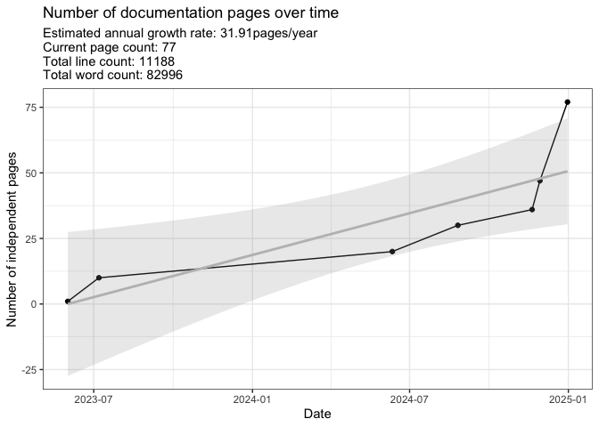
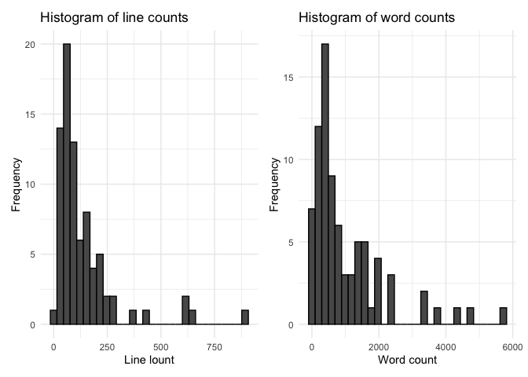

# Documentation log count

Last update:

    ## [1] "2025-01-08"

This doc was built with:
`rmarkdown::render("documentation_log.Rmd", output_file = "../pages/documentation_log.md")`

Below is the latest count of documentation pages. This figure is updated
sporadically to track the current page count and estimated growth rate.
This count only considers the main sources in `./pages` but ignores
other code pages, images, etc.

<!-- -->

    ## Regression Summary:

    ## 
    ## Call:
    ## lm(formula = FileCount ~ DateNumeric, data = df)
    ## 
    ## Residuals:
    ##        1        2        3        4        5        6        7 
    ##   0.9994   6.8523 -12.8702  -9.5141 -11.0321  -0.8189  26.3837 
    ## 
    ## Coefficients:
    ##               Estimate Std. Error t value Pr(>|t|)  
    ## (Intercept) -1.705e+03  4.977e+02  -3.427   0.0187 *
    ## DateNumeric  8.742e-02  2.505e-02   3.490   0.0175 *
    ## ---
    ## Signif. codes:  0 '***' 0.001 '**' 0.01 '*' 0.05 '.' 0.1 ' ' 1
    ## 
    ## Residual standard error: 14.98 on 5 degrees of freedom
    ## Multiple R-squared:  0.709,  Adjusted R-squared:  0.6508 
    ## F-statistic: 12.18 on 1 and 5 DF,  p-value: 0.01746

    ## Estimated Annual Growth Rate (pages/year): 31.91

    ## Current count: 77

<!-- -->

## Change log

See `generate_gitlog.sh` for usage.

- [View Git Log 2025](../gitlog_2025.txt)
- [View Git Log 2024](../gitlog_2024.txt)
- [View Git Log 2023](../gitlog_2023.txt)

(current year log may not be up-to-date)

## 2025

Wed Jan 8 10:28:21 2025 +0100 - DylanLawless: pca gwas tutorial link

Wed Jan 8 10:14:38 2025 +0100 - DylanLawless: multiblock data fusion
methods

Tue Jan 7 14:51:50 2025 +0100 - DylanLawless: PCA RNA de examples and
reading

Tue Jan 7 14:34:03 2025 +0100 - DylanLawless: poplation structure

Tue Jan 7 13:37:20 2025 +0100 - DylanLawless: pca king ibd

Mon Jan 6 18:19:10 2025 +0100 - DylanLawless: pca features

Thu Jan 2 14:12:02 2025 +0100 - DylanLawless: release docs

Thu Jan 2 10:49:11 2025 +0100 - DylanLawless: causal inference stats

Git log for 2025 contains 7 entries and is saved to gitlog_2025.txt

## 2024

Fri Dec 20 16:34:53 2024 +0100 - DylanLawless: pca page

Fri Dec 20 00:03:46 2024 +0100 - DylanLawless: metrics

Wed Dec 18 17:07:52 2024 +0100 - DylanLawless: slurm notes

Tue Dec 17 15:36:35 2024 +0100 - DylanLawless: design docs naviation and
content linked

Tue Dec 17 13:07:00 2024 +0100 - DylanLawless: metrics pages

Mon Dec 16 15:53:57 2024 +0100 - DylanLawless: qv page

Mon Dec 16 10:07:32 2024 +0100 - dylan: design docs DNA v1

Sat Dec 14 11:46:50 2024 +0100 - DylanLawless: vcf gvcf and QV protocol
started

Tue Dec 10 19:02:52 2024 +0100 - DylanLawless: search function

Tue Dec 10 18:53:01 2024 +0100 - DylanLawless: host error

Tue Dec 10 18:18:22 2024 +0100 - DylanLawless: ref page update

Thu Dec 5 15:01:01 2024 +0100 - dylan: annotation table

Thu Dec 5 14:05:24 2024 +0100 - dylan: acmg criteria scoring

Wed Dec 4 20:01:58 2024 +0100 - DylanLawless: conflicts

Wed Dec 4 19:59:11 2024 +0100 - DylanLawless: bayes mutiparam biassay
for ld50

Wed Dec 4 17:51:33 2024 +0100 - DylanLawless: mcmc samplers with demo

Mon Dec 2 12:33:31 2024 +0100 - DylanLawless: sofa score

Sat Nov 30 15:22:58 2024 +0100 - dylan: bayes multiparam

Sat Nov 30 10:37:36 2024 +0100 - dylan: plotted example of bayes
multiparam nuicence param

Fri Nov 29 22:16:17 2024 +0100 - dylan: gemfile fix

Fri Nov 29 22:07:15 2024 +0100 - dylan: bayes multiparam

Fri Nov 29 16:57:19 2024 +0100 - DylanLawless: unfinished bayes
multiparam

Fri Nov 29 14:46:41 2024 +0100 - DylanLawless: index page image

Fri Nov 29 14:42:56 2024 +0100 - DylanLawless: documentation log page

Fri Nov 29 13:44:41 2024 +0100 - DylanLawless: altman plot path update

Fri Nov 29 12:46:14 2024 +0100 - DylanLawless: several altman and bland
methods as stats pages

Fri Nov 29 10:22:31 2024 +0100 - dylan: discretete prob bayes example

Thu Nov 28 14:17:55 2024 +0100 - DylanLawless: remove trash pages

Wed Nov 27 14:29:27 2024 +0100 - DylanLawless: phoenix values

Wed Nov 27 14:18:11 2024 +0100 - DylanLawless: phoenix figures

Wed Nov 27 13:58:17 2024 +0100 - DylanLawless: phoenix score

Wed Nov 20 12:42:40 2024 +0100 - DylanLawless: slurm manager note

Wed Nov 20 12:36:14 2024 +0100 - DylanLawless: slurm manage

Wed Nov 20 12:34:09 2024 +0100 - DylanLawless: slurm manage

Sun Nov 17 19:33:37 2024 +0100 - dylan: bayesian 2

Wed Nov 13 16:40:02 2024 +0100 - DylanLawless: Baysian example BDA3

Wed Nov 13 16:32:35 2024 +0100 - DylanLawless: Baysian example BDA3

Wed Nov 6 18:40:46 2024 +0100 - DylanLawless: download links

Wed Nov 6 17:49:20 2024 +0100 - DylanLawless: added downloads

Wed Nov 6 17:35:34 2024 +0100 - DylanLawless: semantic evidence network
plots

Mon Nov 4 09:40:44 2024 +0100 - DylanLawless: bevimed

Fri Nov 1 17:49:11 2024 +0100 - DylanLawless: complete sequencing_assay
concepts

Tue Oct 22 11:29:20 2024 +0200 - Dylan: updated variant concepts

Mon Sep 23 14:34:22 2024 +0200 - dylan: SPHN concept merge updates

Mon Sep 23 14:13:58 2024 +0200 - dylan: SPHN concept merge updates

Fri Sep 20 12:25:53 2024 +0200 - DylanLawless: aims to RDF

Fri Sep 20 11:59:01 2024 +0200 - DylanLawless: download paths

Fri Sep 20 11:46:43 2024 +0200 - DylanLawless: variant to RDF mapping
prep

Wed Aug 28 12:59:25 2024 +0200 - dylan: docker with singularity

Wed Aug 28 11:06:12 2024 +0200 - dylan: acat images

Wed Aug 28 10:50:32 2024 +0200 - dylan: acat pngs

Wed Aug 28 10:31:48 2024 +0200 - dylan: acat

Tue Aug 27 13:13:34 2024 +0200 - DylanLawless: guru

Tue Aug 27 13:00:30 2024 +0200 - DylanLawless: acmg criteria

Tue Aug 27 11:19:06 2024 +0200 - DylanLawless: mathjax

Mon Aug 26 17:21:49 2024 +0200 - dylan: vsat skat

Mon Aug 26 14:59:32 2024 +0200 - dylan: filter vcf with bcftools

Fri Aug 23 15:36:13 2024 +0200 - Dylan: vsat setid

Tue Aug 20 17:36:10 2024 +0200 - Dylan: sv docs, sbatch, variables

Mon Aug 19 15:50:11 2024 +0200 - dylan: typos

Mon Aug 19 15:47:11 2024 +0200 - dylan: benchmarking

Mon Aug 19 15:22:31 2024 +0200 - dylan: synth data

Mon Aug 19 15:18:13 2024 +0200 - dylan: synth data

Mon Aug 19 14:59:14 2024 +0200 - dylan: synth data

Mon Aug 19 14:54:23 2024 +0200 - dylan: synthetic data

Wed Aug 7 15:57:54 2024 +0200 - dylan: 1kg pca

Mon Jul 29 09:48:51 2024 +0200 - Dylan: Merge branch ‘main’ of
github.com:SwissPedHealth-PipelineDev/docs into main

Mon Jul 29 09:48:34 2024 +0200 - Dylan: gwas page

Wed Jul 24 15:08:01 2024 +0200 - DylanLawless: virtual gene panels

Fri Jul 19 17:03:57 2024 +0200 - DylanLawless: benchmark errors

Wed Jul 17 14:44:33 2024 +0200 - dylan: benchmark

Wed Jul 17 14:22:03 2024 +0200 - dylan: benchmark

Wed Jul 17 10:09:34 2024 +0200 - dylan: whitepaper link

Wed Jul 17 10:00:47 2024 +0200 - dylan: precision med

Wed Jul 17 09:46:21 2024 +0200 - dylan: .nojekyll to prevent github from
building

Wed Jul 17 09:43:01 2024 +0200 - dylan: gem

Wed Jul 17 09:40:37 2024 +0200 - dylan: config

Wed Jul 17 09:35:21 2024 +0200 - dylan: Merge branch ‘main’ of
github.com:SwissPedHealth-PipelineDev/docs into main

Wed Jul 17 09:35:08 2024 +0200 - dylan: pmu

Tue Jul 16 17:26:36 2024 +0200 - dylan: pmu page

Wed Jul 10 13:39:26 2024 +0200 - DylanLawless: Merge branch ‘main’ of
dylanlawless.github.com:SwissPedHealth-PipelineDev/docs

Tue Jul 9 14:10:39 2024 +0200 - Dylan: quick start index

Tue Jul 9 13:46:03 2024 +0200 - Dylan: gem

Tue Jul 9 13:35:31 2024 +0200 - Dylan: ref path

Thu Jun 13 12:32:41 2024 +0200 - Dylan: read group with bwa

Tue Jun 11 14:33:05 2024 +0200 - Dylan: Merge branch ‘main’ of
github.com:SwissPedHealth-PipelineDev/docs into main

Tue Jun 11 14:18:41 2024 +0200 - Dylan: aggregate multiplex read group

Fri Jun 7 13:30:52 2024 +0200 - DylanLawless: Merge branch ‘main’ of
dylanlawless.github.com:SwissPedHealth-PipelineDev/docs

Sun Jun 2 11:14:29 2024 +0200 - dylan: test

Fri May 31 16:50:17 2024 +0200 - Dylan: gatk pages

Fri Mar 1 15:28:53 2024 +0100 - DylanLawless: Merge branch ‘main’ of
dylanlawless.github.com:SwissPedHealth-PipelineDev/docs

Git log for 2024 contains 90 entries and is saved to gitlog_2024.txt

## 2023

Wed Nov 8 15:30:44 2023 +0100 - Dylan: rnaseq

Wed Aug 23 11:45:54 2023 +0200 - Dylan: design docs

Tue Aug 1 10:07:14 2023 +0200 - Dylan: git

Thu Jul 27 10:51:04 2023 +0200 - Dylan: fastp

Wed Jul 26 08:05:42 2023 +0200 - Dylan: rna design start

Tue Jul 25 13:22:57 2023 +0200 - Dylan: fastq

Sun Jul 9 09:21:02 2023 +0200 - Dylan: progress notes

Sun Jul 2 19:16:01 2023 +0200 - Dylan: presentation template

Wed Jun 21 16:26:30 2023 +0200 - DylanLawless: bookmark

Wed Jun 21 11:22:46 2023 +0200 - DylanLawless: concept examples

Mon Jun 19 18:44:59 2023 +0200 - DylanLawless: revert missing annotation
table head code

Mon Jun 19 18:14:49 2023 +0200 - DylanLawless: concepts

Fri Jun 16 17:37:07 2023 +0200 - DylanLawless: data stream image

Fri Jun 16 17:33:11 2023 +0200 - DylanLawless: pages: hpc, data stream,
concepts

Thu Jun 15 19:09:10 2023 +0200 - DylanLawless: data stream page

Thu Jun 15 18:22:38 2023 +0200 - DylanLawless: data stream page

Thu Jun 8 11:09:30 2023 +0200 - DylanLawless: layout.md

Fri Jun 2 11:57:01 2023 +0200 - DylanLawless: mission

Wed May 31 18:24:26 2023 +0200 - Dylan: move favicon to root due to not
displ on sub pages

Wed May 31 18:17:18 2023 +0200 - Dylan: favocon color for pinned tab
mask

Wed May 31 18:08:41 2023 +0200 - Dylan: favicon on safari pinned error

Wed May 31 17:59:02 2023 +0200 - Dylan: favicon

Wed May 31 17:33:48 2023 +0200 - Dylan: design docs

Wed May 31 15:23:16 2023 +0200 - Dylan: method tests for pdf

Wed May 31 11:03:26 2023 +0200 - Dylan: index page

Wed May 31 09:40:34 2023 +0200 - Dylan: realtive links for githubpages

Wed May 31 09:38:16 2023 +0200 - Dylan: realtive links for githubpages

Wed May 31 09:19:08 2023 +0200 - Dylan: annotation table

Wed May 31 07:47:37 2023 +0200 - Dylan: test table

Mon May 29 14:46:07 2023 +0200 - Dylan: sidebar

Mon May 29 14:43:12 2023 +0200 - Dylan: sidebar

Mon May 29 14:36:54 2023 +0200 - Dylan: config and nav logo

Mon May 29 14:30:53 2023 +0200 - Dylan: logo test

Mon May 29 14:27:47 2023 +0200 - Dylan: variables note test

Mon May 29 14:25:46 2023 +0200 - Dylan: Non-mimums features from just
the docs repo

Mon May 29 14:14:22 2023 +0200 - Dylan: config

Mon May 29 14:08:29 2023 +0200 - Dylan: config

Mon May 29 13:55:10 2023 +0200 - Dylan: nav oder test

Mon May 29 13:52:24 2023 +0200 - Dylan: present

Mon May 29 13:31:54 2023 +0200 - Dylan: 404

Mon May 29 13:30:33 2023 +0200 - Dylan: page meta

Mon May 29 13:27:30 2023 +0200 - Dylan: docs dir

Mon May 29 13:25:16 2023 +0200 - Dylan: readme

Mon May 29 13:23:49 2023 +0200 - Dylan: mv

Mon May 29 13:23:06 2023 +0200 - Dylan: README

Mon May 29 13:02:16 2023 +0200 - DylanLawless: Update index.md

Mon May 29 12:53:49 2023 +0200 - DylanLawless: Update \_config.yml

Mon May 29 12:52:04 2023 +0200 - DylanLawless: Update README.md

Mon May 29 12:51:37 2023 +0200 - DylanLawless: Update index.md

Fri May 12 17:21:19 2023 +0000 - DylanLawless: Initial commit

Git log for 2023 contains 49 entries and is saved to gitlog_2023.txt
