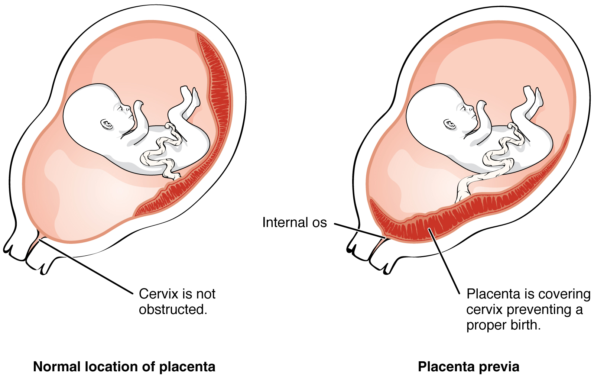

```{r setup, include=FALSE}
knitr::opts_chunk$set(echo = TRUE, fig.path='../assets/images/')  # Make sure this path is correct
```

# Bayesian: Part 1 Probability of a girl birth given placenta previa

Last update:
```{r, date, echo = FALSE}
print(Sys.Date())
```

This doc was built with: `rmarkdown::render("Bayesian_example1.Rmd", output_file = "../pages/bayesian_example1.md")`

## Introduction

This example is described in the textbook:
Bayesian Data Analysis, by Andrew Gelman, John Carlin, Hal Stern, David Dunson, Aki Vehtari, and Donald Rubin. Third edition, (BDA3),
<http://www.stat.columbia.edu/~gelman/book/>.
The code is based on a version by Aki Vehtari. 

In an interesting Bayesian case study, we examine the probability of a girl birth among births with the condition placenta previa, where the placenta obstructs a normal vaginal delivery. An early study in Germany found that out of 980 births with placenta previa, 437 were female. We aim to assess the evidence supporting the hypothesis that the proportion of female births in this condition is less than the general population proportion of 0.485.


<https://commons.wikimedia.org/wiki/Category:Placenta_previa#/media/File:2906_Placenta_Previa-02.jpg> CC BY 3.0.

## Bayesian Framework

### Data and Model

We define the observed study data: 

* $$X = 437$$ - number of female births in placenta previa
* $$Y = 543$$ - number of male births in placenta previa
* $$n = 980$$ - total births in placenta previa
* $$0.485$$ - frequency of normal female births in the population
* Posterior is Beta(438,544)

The parameter of interest, $$\theta$$, represents the probability of a female birth in placenta previa cases.
We calculate and plot the posterior distribution of the proportion of $$\theta$$, using uniform prior on $$\theta$$.


In Bayesian analysis, especially when dealing with proportions like the probability of a girl birth in this scenario, understanding the entire distribution is crucial. The Beta distribution, being the **conjugate prior** for **binomial likelihoods**, is particularly sensitive to the shape parameters ($$\alpha$$ and $$\beta$$), which in this case are derived from the observed data (437 girls, 543 boys) plus one for each due to the uniform prior assumption ($$\alpha = X + 1$$, $$\beta = n - X + 1$$):

- **Alpha (438)**: Represents the number of successes (female births) plus one.
- **Beta (544)**: Represents the number of failures (male births) plus one.

{: .note }

**Binomial likelihoods**: This relates to scenarios where you have binary data that result from a series of trials with two possible outcomes (like success and failure). For example, flipping a coin multiple times and counting how many times it lands heads is a situation that would use a binomial likelihood because each flip has two possible outcomes (heads or tails).

{: .note }

**Conjugate prior**: A conjugate prior is a special type of prior that, when used with a particular likelihood function (like the binomial likelihood), results in a posterior distribution that is the same type of distribution as the prior. This is useful because it simplifies the mathematical calculations involved in updating beliefs with new data.


```{r Bayes_ex1_dataset, include=TRUE}
library(ggplot2)
theme_set(theme_bw())
# Posterior is Beta(438,544)

# seq creates evenly spaced values
df1 <- data.frame(theta = seq(0.375, 0.525, 0.001)) 
a <- 438
b <- 544 

```

```{r Bayes_ex1_dataext, include=FALSE}

pop_freq <- 0.485
lab_pop <- paste0("Population\nfrequency of\nfemale births:\n", pop_freq)
```
### Prior and Posterior Distributions

Under a **uniform prior distribution** (implying no prior bias towards specific values), the beta distribution is utilised as the conjugate prior. The posterior distribution then is:

$$ \text{Posterior}(\theta) = \text{Beta}(\alpha + X, \beta + n - X) = \text{Beta}(438, 544) $$

This choice of prior reflects an initial belief that all values of $$\theta$$ are equally likely, from 0 to 1.

```{r Bayes_ex1_beta, include=TRUE}
# dbeta computes the posterior density
df1$p <- dbeta(df1$theta, a, b)
```

```{r Bayes_ex1_ci, include=TRUE}
# compute also 95% central interval
# seq creates evenly spaced values from 2.5% quantile
# to 97.5% quantile (i.e., 95% central interval)
# qbeta computes the value for a given quantile given parameters a and b
df2 <- data.frame(theta = seq(qbeta(0.025, a, b), qbeta(0.975, a, b), length.out = 100))
```

```{r Bayes_ex1_post, include=TRUE}
# compute the posterior density
df2$p <- dbeta(df2$theta, a, b)
```


```{r, stats, include=TRUE}
data_mean <- round(mean(df2$theta), digits = 3)
data_sd <- round(sd(df2$theta), digits = 3)
data_lab <- paste0("Frequency of\nfemale births\nin placenta previa\nmean = ", data_mean, "\nsd = ", data_sd)
```

```{r Bayes_ex1_plot, include=TRUE}
# Plot posterior (Beta(438,544)) and 48.8% line for population average
ggplot(mapping = aes(theta, p)) +
  geom_line(data = df1) +
  # Add a layer of colorized 95% posterior interval
  geom_area(data = df2, aes(fill='1')) +
  
  geom_vline(xintercept = data_mean, linetype='dotted') +
  annotate(geom = "label", label = data_lab, x = data_mean, y = 20, hjust = 0, fill = "white", alpha = 0.5) +
  
  # Add the proportion of girl babies in general population
  geom_vline(xintercept = pop_freq, linetype='dotted') +
  annotate(geom = "label", label = lab_pop, x = pop_freq, y = 20, hjust = 0, fill = "white",  alpha = 0.5) +
  # Decorate the plot a little
  labs(title='Uniform prior -> Posterior is Beta(438,544)') +
  scale_y_continuous(expand = c(0, 0.1)) +
  scale_fill_manual(values = 'lightblue', labels = '95% posterior interval') +
  theme(legend.position = 'bottom', legend.title = element_blank())

```


### Posterior Analysis

#### Calculation Methods

- **Analytical approach:** Using properties of the beta distribution, the posterior mean is 0.446 and the posterior standard deviation is 0.016.
- **Simulation approach:** Drawing 1000 samples from the Beta(438, 544) posterior, the sample mean and standard deviation closely match the analytical results.

#### Confidence Intervals

- **Beta quantiles:** The 95% confidence interval for $$\theta$$ from beta properties is [0.415, 0.477].
- **Simulation-based estimate:** Using ordered draws, the 95% interval is similarly [0.415, 0.476].
- **Normal approximation:** For practical ease, a normal approximation gives [0.414, 0.476], indicating robustness of the estimate.

### Enhanced precision with logit transformation

Transforming $$\theta$$ to the logit scale:

$$ \text{logit}(\theta) = \log\left(\frac{\theta}{1-\theta}\right) $$

This transformation stabilises variance, especially beneficial for values of $$\theta$$ near boundaries. The logit-transformed values follow a normal distribution, allowing us to back-calculate the confidence interval for $$\theta$$ effectively.

## Considerations on prior sensitivity

Exploring different **conjugate priors** with varying strengths of belief around the general population proportion (0.485), the results show that large sample sizes dilute the influence of these priors, as seen with the posterior distributions retaining similar confidence intervals across various priors.

## Plotting decision
The choice of the values for the sequence `seq(0.375, 0.525, 0.001)` in `df1`  is designed to provide a visualization of the posterior probability density function (pdf) of $$\theta$$ (the probability of a girl birth given placenta previa) over a relevant range of $$\theta$$ values.

- **Start (0.375) and end (0.525)**: These values define the range over which the posterior distribution will be evaluated and plotted. The range is chosen to be slightly broader than the central 95% posterior interval calculated from the Beta distribution (Beta(438, 544)), which is [0.415, 0.477]. This broader range allows the plot to display the tails of the distribution, providing a complete view of how the density behaves towards the edges, which is informative for understanding the distribution's shape and spread.
- **Relevance to the data**: The range centers around the expected posterior mean ($$0.446$$) and includes the entire 95% confidence interval, thereby capturing the most statistically significant values of $$\theta$$ under the given model and data.

## Conclusion

Based on the data, the probability of a female birth given placenta previa is less than the general population's proportion. The findings are consistent despite different computational methods and prior assumptions, illustrating the power of Bayesian inference in real-world data interpretation.
